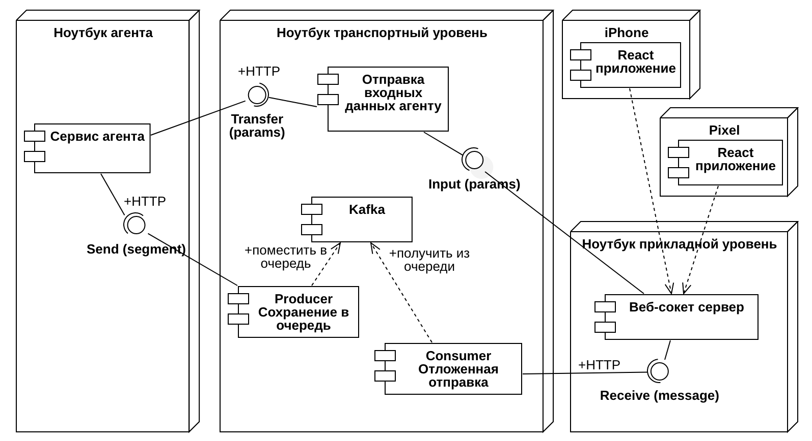

# Сетевые технологии

# Курсовой проект 2024

Создание распределенной информационной системы в соответствии с вариантом

### Сроки

- 3 неделя: Выбрать тему-вариант, определить команду и сформировать ТЗ. В ТЗ должны быть четко указаны требования к каждому из участников.
- 8 неделя: макет figma (ссылку на figma добавить в ТЗ), диаграммы, swagger
- 12 неделя: полный комплект документов (ТЗ, РПЗ, ПМИ, РП, РСА)
- 14-15 неделя: защита, презентация по диаграммам, демонстрация приложения, ответы на вопросы 

- [Регистрация в государственном реестре ПО](https://rospatent.gov.ru/ru/stateservices/gosudarstvennaya-registraciya-programmy-dlya-elektronnyh-vychislitelnyh-mashin-ili-bazy-dannyh-i-vydacha-svidetelstv-o-gosudarstvennoy-registracii-programmy-dlya-elektronnyh-vychislitelnyh-mashin-ili-bazy-dannyh-ih-dublikatov)

### Документация

Документация
1. `ТЗ` - каждый оформляет пункты и разделы по своей части
2. `РПЗ` - каждый оформляет пункты и разделы по своей части
3. `Руководство пользователя` (РП) оформляет Прикладной уровень: описание интерфейса и руководство по работе с приложением
4. `Руководство Системного Администратора` (РСА) - каждый оформляет пункты и разделы по своей части: системные требования, инструкция по развертыванию системы (ссылки на репозиторий), для каких компонентов что потребуется
5. `Программа и методичка испытаний` (ПМИ) - каждый оформляет пункты по своей части: тестирование функционала приложения в таблице последовательно по пунктам (функция из ТЗ, действие, результаты и маленький скриншот). Должны быть протестированы все пункты ТЗ.
6. GitHub - каждый оформляет по своей части
7. Swagger - каждый делает файлы по своему сервису
8. Диаграммы последовательности - каждый оформляет по своей части, с кем взаимодействует и подробнее ваша часть
9. Диаграмма развертывания - общая у всех
10. Макет figma - Прикладной уровень

#### Структура РПЗ: 

- Введение (актуальность с цифрами и датами, цель, назначение, нефункциональные требования, задачи)
- Описание сервиса транспортного уровня с диаграммой последовательности и диаграммой развертывания
- Описание сервиса канального уровня с диаграммой последовательности
- Описание прикладного уровня с диаграммой последовательности и скриншотами интерфейса 
- Заключение: по пунктам решенные задачи и достигнутые результаты
- Список литературы. На каждый источник должна быть ссылка в тексте РПЗ
- 4 приложения: ТЗ, ПМИ, РП, РСА. У каждого приложения свой титульный лист

#### Требования к документации: 
* Необходимо каждому студенту распечатать свой титульный лист РПЗ
* Титульные листы к РПЗ [здесь](https://e-learning.bmstu.ru/iu5/mod/folder/view.php?id=376)
* ГОСТ (1.5 интервал, 1.25 см отступ, 14 пт и тд). Шрифт на рисунках должен быть такой же как в тексте.
* Все заголовки в курсовой должны быть с новой страницы через разрыв
* Параграфы должны быть минимум 300 слов
* Схемы не должны дублироваться в приложениях, если используются в РПЗ. Выносите в приложения очень большие диаграммы, которые не помещаются в РПЗ.

[Примеры документации 2024 года](/docs)

#### Проверка документации
1. Проверка оформления через Контроль ВКР [testVKR через vpn](http://vkr.bmstu.ru/)
2. Проверка на плагиат через [antiplagiat](https://www.antiplagiat.ru)

### Демонстрация
1. Сначала сказать тему и цель работы, задачи каждого исполнителя. 
2. Далее каждый отвечает по своей части. Упор на сетевое взаимодействие: кто какие компоненты реализовал, какие протоколы использовал. 
3. Необходимо по каждой части объяснить: технология вашего агента, про протокол WebSocket (отличия от HTTP, преимущества и недостатки), про congestion control TCP и Kafka
4. Быть готовым объяснить вашу работу на диаграмме последовательности или по коду вашего сервиса.
5. Демонстрация выполняется на 3 компьютерах, объединненых в одну локальную сеть
6. В демонстрации показать вкладку Network или консоль вашего сервиса. Вызывать методы вашего сервиса через `postman`/`insomnia`.

### Вопросы для защиты
1. Что такое канал? Что такое прикладной уровень? Почему они так называются. 
2. Какого размер кадр? Какое максимальное количество ошибок в кадре можно исправить? 
3. Что такое сеть, что такое нагрузка? 
4. Модель OSI

### Задание

Необходимо разработать систему обмена текстовыми сообщениями/файлами/телеметрией в реальном времени, состояющую из трех уровней: прикладной, транспортный и канальный. Каждый из уровней реализуется отдельным веб-сервисом. Для каждого варианта нужно передавать в JSON через все три уровня данные по вашей теме (начальные координаты, временной отрезок, название и тд) - эти поля будут только у вашего варианта и называются по вашей теме в Swagger.

- [Настройка виратульной локальной сети ZeroTier](/tutorials/zerotier/) 

  

#### Прикладной уровень 

Интерфейс реализован на React + Redux Toolkit + Axios + MUI, дизайн должен копировать сайт по вашей теме. Он представляет собой окно чата с возможностью ввода текстового сообщения или отправки файла. При подключении необходимо ввести имя пользователя (открытие WebSocket соединения), которое будет передаваться с каждым сообщением. При обновлении страницы история чата не сохраняется. С помощью кнопки выйти можно отчистить чат и логин (закрытие WebSocket соединения), чтобы потом сменить пользователя. Если сообщение пришло с признаком ошибки - текст/файл не отображается, а в чате отображается значок ошибки.

Для метода `Send` формирует json сообщение с указанием отправителя, времени отправки и полезной нагрузки - текста или файла. При получении нового сообщения методом `Receive` - json с указанием отправителя, времени отправки, признака ошибки и полезной нагрузки.

- [Прикладной уровень WebSocket](/web-socket-chat/) по шагам. [Мастер-класс](https://vk.com/video-211704031_456239165) WebSocket по шагам
- [Методические указания](https://github.com/iu5git/Web/blob/main/tutorials/lab1-design/README.md) по верстке и дизайну Figma. [Инструкция](https://github.com/iu5git/Standards/blob/main/docs/Tutorial_MUI.pdf) по Figma MUI 

#### Транспортный уровень

Текстовые сообщения, телеметрия или файлы разбиваются на сегменты по X байт и отправляются отдельными сегментами на канальный уровень. 

При получении сегменты помещаются в очередь, раз в N секунд собираются в единое сообщение и передаются на прикладной уровень. Если часть из сегментов не была принята (1-3 цикла не было новых сегментов по этому сообщению), то на прикладной уровень итоговое сообщение передается с признаком ошибки.

Каждый пакет-сегмент представляет собой полезную нагрузку, времени отправки (как id сообщения), общую длину сообщения (количество сегментов), номер данного сегмента в сообщении.

- [Транспортный уровень Kafka+Docker](/golang_kafka/) в Golang. [Мастер-класс](https://vk.com/video-211704031_456239164) Kafka Golang
- [Пример работы с очередями Kafka в Python](/kafka) 
- [Ролик про межсервисное взаимодействие и очереди](https://www.youtube.com/watch?v=zdKziDsFjvg)

#### Агентный уровень

Данный уровень выполняет одну из трех разных функций в зависимости от варианта. Это либо 
- генерация текста в ответ на запрос пользователя с помощью локальной LLM на ноутбуке агента (НЕ браузер) на 1-7 млрд, ответ приходит частями (по 2-3 предложения например)
- Передача мультимедиа файла по частям, каждый файл нужно на этом уровне разбить на части, каждую часть отправить отдельным запросом (например видео 200 Мб разбить на 12 частей по 17 Мб). Файл хранится в объектном хранище (Minio и аналоги)
- Передача телеметрии робота порциями раз в несколько секунд. Желательно развернуть агента внутри виртуалки с ROS2, внутри сервис на FastAPI. И как остальные варианты эта виртуалка общается с транспортным уровнем по HTTP.

## Варианты

### Передача мультимедиа

#### Мультимедиа вариант 1

Передача тайла от спутника ДЗЗ. Храним 16 тайлов из квадратной сетки, для получения нужного вводим две координаты тайла, который хотим получить.

#### Мультимедиа вариант 2

Передача короткого видео. Храним 10-20 последовательных кусков фильма по 5 минут. Для получения нужного вводим начальную минуту фильма, которая соответствует этому кусочку.

#### Мультимедиа вариант 3
Передача панорамного изображения. Храним 8 сегментов круговой панорамы по 45 градусов. Для получения нужного вводим угол поворота камеры от 0 до 360 градусов.

#### Мультимедиа вариант 4
Передача аудиокниги по главам. Храним 20-30 аудиофайлов с отдельными главами произведения. Для получения нужной вводим номер главы или временную метку начала.

#### Мультимедиа вариант 5
Передача кадров с камеры видеонаблюдения. Храним 50 отрезков по 5 минут видеозаписи за сутки. Для получения нужного вводим час и минуту, которые соответствуют нужному отрезку.

#### Мультимедиа вариант 6
Передача слоев географической карты. Храним векторные слои карты (рельеф, дороги, здания, растительность). Для получения нужного вводим тип слоя.

#### Мультимедиа вариант 7
Передача снимков с микроскопа. Храним серию снимков с разным увеличением (x10, x40, x100, x400, x1000). Для получения нужного вводим требуемое увеличение и номер ислледуемого образца.

#### Мультимедиа вариант 8
Передача кадров 3D-модели. Храним 36 кадров модели с разных ракурсов (каждые 10 градусов). Для получения нужного вводим угол поворота модели.

#### Мультимедиа вариант 9
Передача звуковых дорожек многоканального аудио. Храним отдельные аудиопотоки (левый, правый, центральный, тыловой). Для получения нужного вводим тип канала.

#### Мультимедиа вариант 10
Передача архивных документов по страницам. Храним отсканированные страницы документа в виде отдельных изображений. Для получения нужной вводим номер страницы.

### Агент генерации текста

#### LLM вариант 1

Суммаризация нейросетью выбранных сообщений. Сообщения выбираются пользователем из чата и затем по кнопке отправляются одним запросом в агент.

#### LLM вариант 2
Перевод текста на указанный язык. Пользователь вводит текст на русском и выбирает целевой язык (английский, французский, испанский). Агент возвращает перевод частями.

#### LLM вариант 3
Применение тональности к отзывам. Пользователь загружает отзыв и указывает желаемую тональность (позитивный, негативный, нейтральный). Агент применяет тональность и возвращает новый результат частями.

#### LLM вариант 4
Генерация названий для товаров. Пользователь вводит описание товара, агент генерирует 5-10 вариантов названий, возвращая их по 2-3 варианта за раз.

#### LLM вариант 5
Отзыв на описание с пояснениями. Пользователь отправляет текстовое описание на 5-10 абзацев, агент анализирует его и добавляет комментарии отдельно для каждого абзаца.

#### LLM вариант 6
Создание структуры документа. Пользователь вводит тему документа, агент генерирует структуру (оглавление, разделы, подразделы) и возвращает частями.

#### LLM вариант 7
Ответы на вопросы по документации. Пользователь загружает фрагмент документации и задает вопрос, агент ищет ответ в загруженном тексте и возвращает найденную информацию частями. При желании можно применить RAG, но не обязательно.

#### LLM вариант 8
Генерация тестовых данных. Пользователь описывает структуру данных (JSON), агент генерирует примеры заполнения этих данных.

#### LLM вариант 9
Упрощение сложных текстов. Пользователь вводит сложный научный или технический текст, агент переписывает его простым языком, возвращая результат частями.

#### LLM вариант 10
Генерация идей для контента. Пользователь вводит тему (блог, видео, пост в соцсетях), агент генерирует 10-15 идей, возвращая их группами по 3-4 идеи.

### Передача телеметрии

#### Телеметрия вариант 1

Робот движется по жилому помещению и транслирует свое положение. Задается два начальных угла положения робота.

#### Телеметрия вариант 2

Программа станка с ЧПУ. Задается последовательность команд для 2D поверхности, для каждой нужные параметры (координаты, длительность, глубина): просверлить отверстие, фрезеровка от начальной кординаты до конечной. В конце возвращается в начальное положение. Транслируется название команды и положение резца робота на 2D поверхности

#### Телеметрия вариант 3
Дрон облетает здание по заданному маршруту. Задаются координаты угловых точек маршрута. Транслируется текущее положение дрона, высота, скорость и заряд батареи.

#### Телеметрия вариант 4
Робот-манипулятор сортирует детали на конвейере. Задаются типы деталей (брак, готовая деталь) и их последовательность на конвейере. Транслируется положение захвата, и состояние захвата (открыт/закрыт).

#### Телеметрия вариант 5
Автономный автомобиль движется по полосе. Задаются параметры дороги (кривизна, ограничения скорости). Транслируется скорость, угол поворота колес, ускорение.

#### Телеметрия вариант 6
Квадрокоптер выполняет видеосъемку местности. Задается область съемки в координатах. Транслируется положение, высота, и остаток памяти для съемки.

#### Телеметрия вариант 7
Робот-пылесос убирает комнату. Задается схема комнаты: многоугольник с прямыми углами без внутренних препятствий. Комнату просто обойти горизонтальными линиями змейкой. Транслируется текущее положение, пройденное расстояние, степень заполнения пылесборника и уровень заряда.

#### Телеметрия вариант 8
Промышленный робот варит швы на корпусе. Задается траектория сварного шва и параметры сварки. Транслируется положение сварочной головки, температура.

#### Телеметрия вариант 9
Роботизированная рука играет в шахматы. Задается последовательность ходов в нотации. Транслируется положение захвата, координаты фигуры на доске и статус захвата.

#### Телеметрия вариант 10
Световое шоу дронов. Задается фигура (из готового списка: сердце, пирамида и тд) и ее длительность, после этого дроны возвращаются в начальное положение. Для каждого робота транслируется его положение.

#### Телеметрия вариант 11
Робот телескоп. Робот находится на заданный точке Земли. Задается последовательность снимков с небесными координатами, которые нужно выполнить роботу. Транслируется углы поворота телескопа.

## Дополнительные материалы

### Система управления роботом
- Модель: создание модуля для операционной системы ROS для реализации протокола передачи по WebSocket команд по управлению роботом
- [Методические указания ROS](/ROS)
- [Пример реализации](https://bmstu.codes/iu5/robo)

## Дополнительные материалы WebSocket
- [Пример реализации](/frontend-template) фронтенда.
- [Ролик про плюсы и минусы WebSocket, LongPolling, event sourcing](https://youtu.be/ItGBCA7bmZc)

### Материалы Long Polling
- [Ролик с примером реализации Long Polling](https://youtu.be/o43iiH4kGqg)
- [Пример взаимодействия через Long Polling](/long_polling/)

