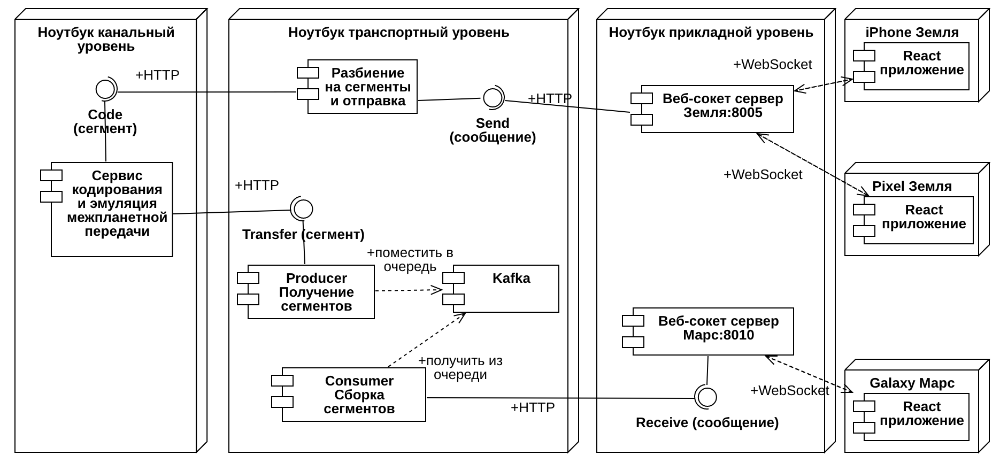

# Сетевые технологии

#### Образ виртуальной машины Linux [Ubuntu 22.04](https://github.com/iu5git/Standards/blob/main/Linux/Linux.md) для выполнения заданий курса

# Курсовой проект 2024

Создание распределенной информационной системы в соответствии с вариантом

### Сроки

- 3 неделя: Выбрать тему-вариант, определить команду и сформировать ТЗ. В ТЗ должны быть четко указаны требования к каждому из участников.
- 8 неделя: макет figma (ссылку на figma добавить в ТЗ), диаграммы, swagger
- 12 неделя: полный комплект документов (ТЗ, РПЗ, ПМИ, РП, РСА)
- 14-15 неделя: защита, презентация по диаграммам, демонстрация приложения, ответы на вопросы 

- [Регистрация в государственном реестре ПО](https://rospatent.gov.ru/ru/stateservices/gosudarstvennaya-registraciya-programmy-dlya-elektronnyh-vychislitelnyh-mashin-ili-bazy-dannyh-i-vydacha-svidetelstv-o-gosudarstvennoy-registracii-programmy-dlya-elektronnyh-vychislitelnyh-mashin-ili-bazy-dannyh-ih-dublikatov)

### Документация

Документация
1. `ТЗ` - каждый оформляет пункты и разделы по своей части
2. `РПЗ` - каждый оформляет пункты и разделы по своей части
3. `Руководство пользователя` (РП) оформляет Прикладной уровень: описание интерфейса и руководство по работе с приложением
4. `Руководство Системного Администратора` (РСА) - каждый оформляет пункты и разделы по своей части: системные требования, инструкция по развертыванию системы, для каких компонентов что потребуется
5. `Программа и методичка испытаний` (ПМИ) - каждый оформляет пункты по своей части: тестирование функционала приложения в таблице последовательно по пунктам (функция из ТЗ, действие, результаты и маленький скриншот). Должны быть протестированы все пункты ТЗ.
6. GitHub - каждый оформляет по своей части
7. Swagger - каждый делает файлы по своему сервису
8. Диаграммы последовательности - каждый оформляет по своей части, с кем взаимодействует и подробнее ваша часть
9. Диаграмма развертывания - общая у всех
10. Макет figma - Прикладной уровень

#### Структура РПЗ: 

- Введение (актуальность с цифрами и датами, цель, назначение, нефункциональные требования, задачи)
- Описание сервиса транспортного уровня с диаграммой последовательности и диаграммой развертывания
- Описание сервиса канального уровня с диаграммой последовательности
- Описание прикладного уровня с диаграммой последовательности и скриншотами интерфейса 
- Заключение: по пунктам решенные задачи и достигнутые результаты
- Список литературы. На каждый источник должна быть ссылка в тексте РПЗ
- 4 приложения: ТЗ, ПМИ, РП, РСА. У каждого приложения свой титульный лист

#### Требования к документации: 
* Необходимо распечатать ТЗ полностью, а также титульный лист и задание курсовой. 1 экз на команду
* Титульные листы к РПЗ [здесь](https://e-learning.bmstu.ru/iu5/mod/folder/view.php?id=376)
* ГОСТ (1.5 интервал, 1.25 см отступ, 14 пт и тд). Шрифт на рисунках должен быть такой же как в тексте.
* Все заголовки в курсовой должны быть с новой страницы через разрыв
* Параграфы должны быть минимум 300 слов
* Схемы не должны дублироваться в приложениях, если используются в РПЗ. Выносите в приложения очень большие диаграммы, которые не помещаются в РПЗ.

[Примеры документации 2023 года](/docs)

#### Проверка документации
1. Проверка оформления через Контроль ВКР [testVKR через vpn](http://vkr.bmstu.ru/)
2. Проверка на плагиат через [antiplagiat](https://www.antiplagiat.ru)

### Презентация и демонстрация
[шаблон презентации](https://bmstu.ru/about/brandbook)
1. На защите нужна презентация по шаблону. Диаграммы должны читаться на презентации, должны быть видны на экране ноутбука. 
2. Введение: цель, задачи, исполнители. 
3. Далее функции системы: диаграмма прецедентов, пользователи, функции системы.
4. Далее архитектура: по deployment - какие компоненты, кто реализовал, какие сетевые протоколы между вашими узлами есть. 
5. Каждый отвечает по своей части. Упор на сетевое взаимодействие: кто какие ноды/компоненты делал, какие протоколы. Показать диаграмму последовательности
6. Заканчивается презентация заключением
7. В демонстрации указать или вкладку Network, показать консоль вашего сервиса. Вызывать метод вашего сервиса.

### Тема

Необходимо разработать систему обмена текстовыми сообщениями/файлами в реальном времени, состояющую из трех уровней: прикладной, транспортный и канальный. Каждый из уровней реализуется отдельным веб-сервисом.

#### Прикладной уровень 

Интерфейс реализован на React + Redux Toolkit + Axios + MUI, дизайн должен копировать сайт российской компании. Он представляет собой окно чата с возможностью ввода текстового сообщения или отправки файла. При подключении необходимо ввести имя пользователя (открытие WebSocket соединения), которое будет передаваться с каждым сообщением. При обновлении страницы история чата не сохраняется. С помощью кнопки выйти можно отчистить чат и логин (закрытие WebSocket соединения), чтобы потом сменить пользователя. Если сообщение пришло с признаком ошибки - текст/файл не отображается, а в чате отображается значок ошибки.

Для метода `Send` формирует json сообщение с указанием отправителя, времени отправки и полезной нагрузки - текста или файла. При получении нового сообщения методом `Receive` - json с указанием отправителя, времени отправки, признака ошибки и полезной нагрузки.

- [Пример реализации](/frontend-template) фронтенда.
- [Методические указания](https://github.com/iu5git/Web/blob/main/tutorials/lab1-design/README.md) по верстке и дизайну Figma. [Инструкция](https://github.com/iu5git/Standards/blob/main/docs/Tutorial_MUI.pdf) по Figma MUI 
- [Поэтапный пример](/websocket-example) табличного редактора через WebSocket. [Пример](/Websocket) мессенджера через WebSocket
- [Обучающее видео по WebSocket, LongPolling, event sourcing](https://youtu.be/o43iiH4kGqg)

#### Транспортный уровень

Текстовые сообщения или файлы разбиваются на сегменты по X байт и отправляются отдельными сегментами на канальный уровень. 

При получении сегменты помещаются в очередь, раз в N секунд собираются в единое сообщение и передаются на прикладной уровень. Если часть из сегментов не была принята, то на прикладной уровень итоговое сообщение передается с признаком ошибки.

Каждый пакет-сегмент представляет собой полезную нагрузку, времени отправки (как id), общую длину сообщения (количество сегментов), номер данного сегмента в сообщении.

- [Ролик про межсервисное взаимодействие и очереди](https://www.youtube.com/watch?v=zdKziDsFjvg)
- [Пример установки Kafka через wsl и использования в Python](/kafka_wsl) 

#### Канальный уровень

Данный уровень эмитирует взаимодействие с удаленным сетевым узлом через канал с помехами. Для этого используется один из четырех вариантов кодирования передаваемых сообщений. Полученный от транспортного уровня json сегмента кодируется в битовый формат соответствующим кодом, вносятся ошибки и затем декодируется для последующей отправки обратно на транспортный уровень.

Сервис должен вносить ошибку с вероятностью P в передаваемую информацию и терять сообщения с вероятностью R. При декодировании либо пакет с ошибкой теряется, либо передается обратно на транспортный после исправления.

- [Пример реализации Циклического кода](https://github.com/DESOLATE17/NetworkingHomework)
- [Пример реализации кода Хемминга](https://github.com/cantylv/homework-bmstu-2023-HammingCode)

## Варианты

#### Вариант 1

Отправка текста. Передаваемую информацию защитить передаваемую информацию циклическим [7,4]-кодом. Длина сегмента (X) 100 байт, период сборки сегментов (N) 2 секунд, вероятность ошибки (P) 10%, вероятность потери кадра (R) 2%.

#### Вариант 2

Отправка текста. Передаваемую информацию защитить передаваемую информацию циклическим [15,11]-кодом. Длина сегмента (X) 100 байт, период сборки сегментов (N) 1 секунд, вероятность ошибки (P) 10%, вероятность потери кадра (R) 2%.

#### Вариант 3

Отправка текста. Передаваемую информацию защитить передаваемую информацию [7,4]-кодом Хэмминга. Длина сегмента (X) 200 байт, период сборки сегментов (N) 2 секунд, вероятность ошибки (P) 10%, вероятность потери кадра (R) 2%.

#### Вариант 4

Отправка текста. Передаваемую информацию защитить передаваемую информацию [15,11]-кодом Хэмминга. Длина сегмента (X) 200 байт, период сборки сегментов (N) 1 секунд, вероятность ошибки (P) 10%, вероятность потери кадра (R) 2%.

#### Вариант 5

Отправка файла. Передаваемую информацию защитить передаваемую информацию циклическим [7,4]-кодом. Длина сегмента (X) 1000 байт, период сборки сегментов (N) 2 секунд, вероятность ошибки (P) 11%, вероятность потери кадра (R) 2%.

#### Вариант 6

Отправка файла. Передаваемую информацию защитить передаваемую информацию циклическим [15,11]-кодом. Длина сегмента (X) 2000 байт, период сборки сегментов (N) 2 секунд, вероятность ошибки (P) 11%, вероятность потери кадра (R) 2%.

#### Вариант 7

Отправка файла. Передаваемую информацию защитить передаваемую информацию [7,4]-кодом Хэмминга. Длина сегмента (X) 1000 байт, период сборки сегментов (N) 1 секунд, вероятность ошибки (P) 11%, вероятность потери кадра (R) 2%.

#### Вариант 8

Отправка файла. Передаваемую информацию защитить передаваемую информацию [15,11]-кодом Хэмминга. Длина сегмента (X) 2000 байт, период сборки сегментов (N) 1 секунд, вероятность ошибки (P) 11%, вероятность потери кадра (R) 2%.

#### Вариант 9

Отправка текста. Передаваемую информацию защитить передаваемую информацию циклическим [7,4]-кодом. Длина сегмента (X) 100 байт, период сборки сегментов (N) 2 секунд, вероятность ошибки (P) 11%, вероятность потери кадра (R) 1%.

#### Вариант 10

Отправка текста. Передаваемую информацию защитить передаваемую информацию циклическим [15,11]-кодом. Длина сегмента (X) 100 байт, период сборки сегментов (N) 1 секунд, вероятность ошибки (P) 9%, вероятность потери кадра (R) 1%.

#### Вариант 11

Отправка текста. Передаваемую информацию защитить передаваемую информацию [7,4]-кодом Хэмминга. Длина сегмента (X) 150 байт, период сборки сегментов (N) 2 секунд, вероятность ошибки (P) 8%, вероятность потери кадра (R) 1%.

#### Вариант 12

Отправка текста. Передаваемую информацию защитить передаваемую информацию [15,11]-кодом Хэмминга. Длина сегмента (X) 100 байт, период сборки сегментов (N) 3 секунд, вероятность ошибки (P) 7%, вероятность потери кадра (R) 1%.

#### Вариант 13

Отправка файла. Передаваемую информацию защитить передаваемую информацию циклическим [7,4]-кодом. Длина сегмента (X) 1000 байт, период сборки сегментов (N) 2 секунд, вероятность ошибки (P) 11%, вероятность потери кадра (R) 1.4%.

#### Вариант 14

Отправка файла. Передаваемую информацию защитить передаваемую информацию циклическим [15,11]-кодом. Длина сегмента (X) 1500 байт, период сборки сегментов (N) 2 секунд, вероятность ошибки (P) 11%, вероятность потери кадра (R) 1.3%.

#### Вариант 15

Отправка файла. Передаваемую информацию защитить передаваемую информацию [7,4]-кодом Хэмминга. Длина сегмента (X) 1800 байт, период сборки сегментов (N) 2 секунд, вероятность ошибки (P) 11%, вероятность потери кадра (R) 1.2%.

#### Вариант 16

Отправка файла. Передаваемую информацию защитить передаваемую информацию [15,11]-кодом Хэмминга. Длина сегмента (X) 1200 байт, период сборки сегментов (N) 2 секунд, вероятность ошибки (P) 11%, вероятность потери кадра (R) 1.2%.

#### Вариант 17

Отправка текста. Передаваемую информацию защитить передаваемую информацию циклическим [7,4]-кодом. Длина сегмента (X) 120 байт, период сборки сегментов (N) 2 секунд, вероятность ошибки (P) 10%, вероятность потери кадра (R) 1.5%.

#### Вариант 18

Отправка текста. Передаваемую информацию защитить передаваемую информацию циклическим [15,11]-кодом. Длина сегмента (X) 130 байт, период сборки сегментов (N) 2 секунд, вероятность ошибки (P) 10%, вероятность потери кадра (R) 1.6%.

#### Вариант 19

Отправка текста. Передаваемую информацию защитить передаваемую информацию [7,4]-кодом Хэмминга. Длина сегмента (X) 140 байт, период сборки сегментов (N) 2 секунд, вероятность ошибки (P) 10%, вероятность потери кадра (R) 1.7%.

#### Вариант 20

Отправка текста. Передаваемую информацию защитить передаваемую информацию [15,11]-кодом Хэмминга. Длина сегмента (X) 150 байт, период сборки сегментов (N) 2 секунд, вероятность ошибки (P) 10%, вероятность потери кадра (R) 1.8%.

#### Вариант 21

Отправка файла. Передаваемую информацию защитить передаваемую информацию циклическим [7,4]-кодом. Длина сегмента (X) 1200 байт, период сборки сегментов (N) 2 секунд, вероятность ошибки (P) 11%, вероятность потери кадра (R) 2%.

#### Вариант 22

Отправка файла. Передаваемую информацию защитить передаваемую информацию циклическим [15,11]-кодом. Длина сегмента (X) 1000 байт, период сборки сегментов (N) 1 секунд, вероятность ошибки (P) 11%, вероятность потери кадра (R) 2%.

#### Вариант 23

Отправка файла. Передаваемую информацию защитить передаваемую информацию [7,4]-кодом Хэмминга. Длина сегмента (X) 1000 байт, период сборки сегментов (N) 1 секунд, вероятность ошибки (P) 12%, вероятность потери кадра (R) 1%.

#### Вариант 24

Отправка файла. Передаваемую информацию защитить передаваемую информацию [15,11]-кодом Хэмминга. Длина сегмента (X) 1400 байт, период сборки сегментов (N) 2 секунд, вероятность ошибки (P) 9%, вероятность потери кадра (R) 1%.

#### Вариант 25

Отправка текста. Передаваемую информацию защитить передаваемую информацию циклическим [7,4]-кодом. Длина сегмента (X) 100 байт, период сборки сегментов (N) 2 секунд, вероятность ошибки (P) 10%, вероятность потери кадра (R) 2%.

#### Вариант 26

Отправка текста. Передаваемую информацию защитить передаваемую информацию циклическим [15,11]-кодом. Длина сегмента (X) 130 байт, период сборки сегментов (N) 2 секунд, вероятность ошибки (P) 11%, вероятность потери кадра (R) 1%.

#### Вариант 27

Отправка текста. Передаваемую информацию защитить передаваемую информацию [7,4]-кодом Хэмминга. Длина сегмента (X) 100 байт, период сборки сегментов (N) 2 секунд, вероятность ошибки (P) 10%, вероятность потери кадра (R) 2%.

#### Вариант 28

Отправка текста. Передаваемую информацию защитить передаваемую информацию [15,11]-кодом Хэмминга. Длина сегмента (X) 110 байт, период сборки сегментов (N) 2 секунд, вероятность ошибки (P) 11%, вероятность потери кадра (R) 1%.

#### Вариант 29

Отправка файла. Передаваемую информацию защитить передаваемую информацию циклическим [7,4]-кодом. Длина сегмента (X) 2000 байт, период сборки сегментов (N) 2 секунд, вероятность ошибки (P) 9%, вероятность потери кадра (R) 2%.

#### Вариант 30

Отправка файла. Передаваемую информацию защитить передаваемую информацию циклическим [15,11]-кодом. Длина сегмента (X) 2500 байт, период сборки сегментов (N) 2 секунд, вероятность ошибки (P) 11%, вероятность потери кадра (R) 1%.

#### Вариант 31

Отправка файла. Передаваемую информацию защитить передаваемую информацию [7,4]-кодом Хэмминга. Длина сегмента (X) 2300 байт, период сборки сегментов (N) 2 секунд, вероятность ошибки (P) 11%, вероятность потери кадра (R) 1%.

#### Вариант 32

Отправка файла. Передаваемую информацию защитить передаваемую информацию [15,11]-кодом Хэмминга. Длина сегмента (X) 2400 байт, период сборки сегментов (N) 2 секунд, вероятность ошибки (P) 8%, вероятность потери кадра (R) 2%.

#### Вариант 33

Отправка текста. Передаваемую информацию защитить передаваемую информацию циклическим [7,4]-кодом. Длина сегмента (X) 140 байт, период сборки сегментов (N) 1 секунд, вероятность ошибки (P) 10%, вероятность потери кадра (R) 2%.

#### Вариант 34

Отправка текста. Передаваемую информацию защитить передаваемую информацию циклическим [15,11]-кодом. Длина сегмента (X) 130 байт, период сборки сегментов (N) 2 секунд, вероятность ошибки (P) 11%, вероятность потери кадра (R) 2%.

#### Вариант 35

Отправка текста. Передаваемую информацию защитить передаваемую информацию [7,4]-кодом Хэмминга. Длина сегмента (X) 120 байт, период сборки сегментов (N) 2 секунд, вероятность ошибки (P) 8%, вероятность потери кадра (R) 2%.

#### Вариант 36

Отправка текста. Передаваемую информацию защитить передаваемую информацию [15,11]-кодом Хэмминга. Длина сегмента (X) 100 байт, период сборки сегментов (N) 1 секунд, вероятность ошибки (P) 10%, вероятность потери кадра (R) 2%.

#### Вариант 37

Отправка файла. Передаваемую информацию защитить передаваемую информацию циклическим [7,4]-кодом. Длина сегмента (X) 1000 байт, период сборки сегментов (N) 2 секунд, вероятность ошибки (P) 11%, вероятность потери кадра (R) 3%.

#### Вариант 38

Отправка файла. Передаваемую информацию защитить передаваемую информацию циклическим [15,11]-кодом. Длина сегмента (X) 3400 байт, период сборки сегментов (N) 2 секунд, вероятность ошибки (P) 11%, вероятность потери кадра (R) 3%.

#### Вариант 39

Отправка файла. Передаваемую информацию защитить передаваемую информацию [7,4]-кодом Хэмминга. Длина сегмента (X) 3200 байт, период сборки сегментов (N) 2 секунд, вероятность ошибки (P) 11%, вероятность потери кадра (R) 3%.

#### Вариант 40

Отправка файла. Передаваемую информацию защитить передаваемую информацию [15,11]-кодом Хэмминга. Длина сегмента (X) 3000 байт, период сборки сегментов (N) 2 секунд, вероятность ошибки (P) 11%, вероятность потери кадра (R) 2%.

#### Вариант 41

Отправка текста. Передаваемую информацию защитить передаваемую информацию циклическим [7,4]-кодом. Длина сегмента (X) 320 байт, период сборки сегментов (N) 1 секунд, вероятность ошибки (P) 10%, вероятность потери кадра (R) 2%.

#### Вариант 42

Отправка текста. Передаваемую информацию защитить передаваемую информацию циклическим [15,11]-кодом. Длина сегмента (X) 100 байт, период сборки сегментов (N) 2 секунд, вероятность ошибки (P) 10%, вероятность потери кадра (R) 3%.

#### Вариант 43

Отправка текста. Передаваемую информацию защитить передаваемую информацию [7,4]-кодом Хэмминга. Длина сегмента (X) 300 байт, период сборки сегментов (N) 1 секунд, вероятность ошибки (P) 10%, вероятность потери кадра (R) 2%.

#### Вариант 44

Отправка текста. Передаваемую информацию защитить передаваемую информацию [15,11]-кодом Хэмминга. Длина сегмента (X) 120 байт, период сборки сегментов (N) 2 секунд, вероятность ошибки (P) 10%, вероятность потери кадра (R) 3%.

#### Вариант 45

Отправка файла. Передаваемую информацию защитить передаваемую информацию циклическим [7,4]-кодом. Длина сегмента (X) 1500 байт, период сборки сегментов (N) 2 секунд, вероятность ошибки (P) 11%, вероятность потери кадра (R) 2.5%.

#### Вариант 46

Отправка файла. Передаваемую информацию защитить передаваемую информацию циклическим [15,11]-кодом. Длина сегмента (X) 1600 байт, период сборки сегментов (N) 2 секунд, вероятность ошибки (P) 11%, вероятность потери кадра (R) 2.3%.

#### Вариант 47

Отправка файла. Передаваемую информацию защитить передаваемую информацию [7,4]-кодом Хэмминга. Длина сегмента (X) 1700 байт, период сборки сегментов (N) 2 секунд, вероятность ошибки (P) 11%, вероятность потери кадра (R) 2.2%.

#### Вариант 48

Отправка файла. Передаваемую информацию защитить передаваемую информацию [15,11]-кодом Хэмминга. Длина сегмента (X) 1800 байт, период сборки сегментов (N) 2 секунд, вероятность ошибки (P) 11%, вероятность потери кадра (R) 2.4%.

## Индивидуальные варианты

* Система управления роботом
- Модель: создание модуля для операционной системы ROS для реализации протокола передачи по WebSocket команд по управлению роботом

[Пример реализации](https://bmstu.codes/iu5/robo)

# Сети и Телекоммуникации

### Вариант 2023 года:

Первое ДЗ - диаграмма развёртывания для архитектуры и диаграмма последовательности для описания сетевого алгоритма.

Второе ДЗ - реализация программы. 

- [Ролик про плюсы и минусы WebSocket, LongPolling, event sourcing](https://youtu.be/ItGBCA7bmZc)
- [Ролик с примером реализации Long Polling](https://youtu.be/o43iiH4kGqg)

#### Реализовать поверх long polling свой канальный уровень для исправления ошибок (циклический код или Хеминг)

Этот вариант учит идее современных беспроводных сетей, что случаются искажения битов. Одна из сторон случайно «портит» биты в данных. 

Нужно восстановить код или найти ошибку. На экране выводятся оригинальное сообщение, «испорченное», восстановленное. И можно сравнить, смогли найти ошибку или нет. 

[Пример взаимодействия через Long Polling](/long_polling/)

