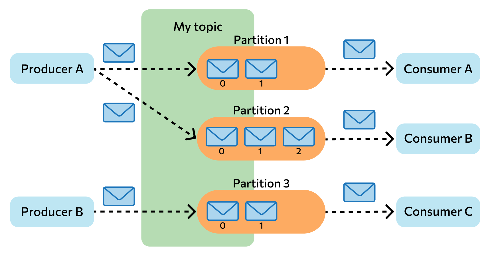
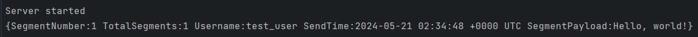
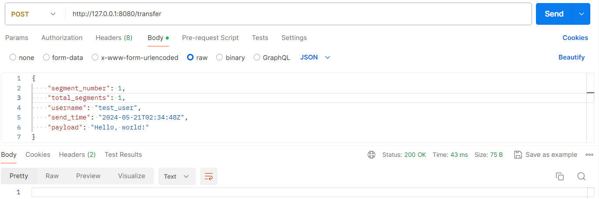
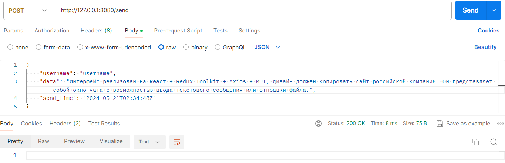
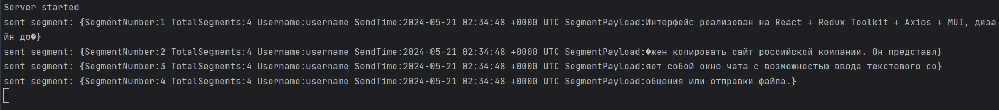
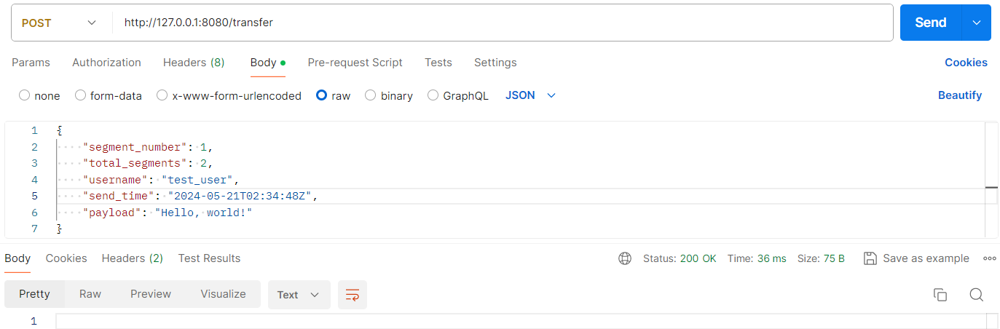
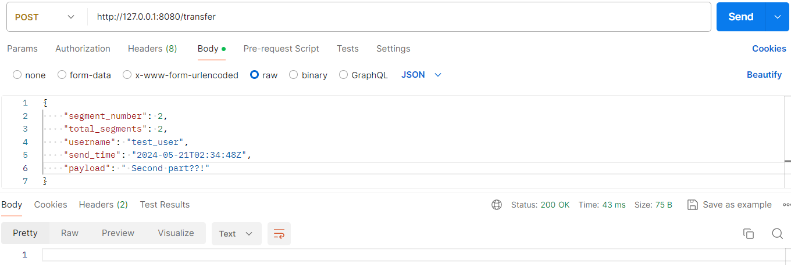
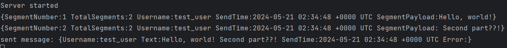
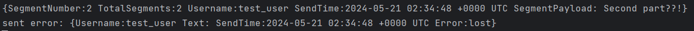

# Работа с Kafka в Go по шагам
Эта методичка поможет вам развернуть Kafka в Docker и подключиться к ней из Go в качестве producer-а и в качестве consumer-а. Также вам будет представлен вариант реализации сегментации сообщений и сборки сегментов в сообщения с обнаружением потери сегментов.

## Оглавление
1. [Асинхронные очереди и Kafka](#асинхронные-очереди-и-kafka)

   1.1. [Основные компоненты Kafka](#основные-компоненты-kafka)

   1.2. [Принцип работы Kafka](#принцип-работы-kafka)

   1.3. [Схема работы Kafka](#схема-работы-kafka)

2. [Реализация системы](#реализация-системы)

   2.1. [Шаг 1. Поднимаем Kafka](#шаг-1-поднимаем-kafka)

   2.2. [Шаг 2. Создание consumer-а в Go](#шаг-2-создание-consumer-а-в-go)

   2.3. [Шаг 3. Создание топика в Kafka и проверка consumer-а](#шаг-3-создание-топика-в-kafka-и-проверка-consumer-а)

   2.4. [Шаг 4. Создание producer-а в Go](#шаг-4-создание-producer-а-в-go)

   2.5. [Шаг 5. Сегментация сообщения](#шаг-5-сегментация-сообщения)

   2.6. [Шаг 6. Сборка сегментов в сообщение](#шаг-6-сборка-сегментов-в-сообщение)

3. [Подведение итогов](#подведение-итогов)

4. [Полезные ссылки](#полезные-ссылки)

## Асинхронные очереди и Kafka
Асинхронные очереди - это механизм межпроцессного взаимодействия, который позволяет одному компоненту приложения отправлять сообщения (данные) в очередь, откуда другой компонент может их считывать и обрабатывать.

Асинхронные очереди часто используются для улучшения масштабируемости и производительности распределенных систем, так как позволяют разным компонентам работать независимо и в разное время.

Apache Kafka - одна из самых популярных систем для реализации асинхронных очередей.

### Основные компоненты Kafka:
- Producer: отправляет сообщения в Kafka.
- Consumer: читает сообщения из Kafka.
- Broker: сервер, который принимает сообщения от producer-ов, сохраняет их и выдает consumer-ам.
- Topic: категория или поток, к которому сообщения записываются и из которого они читаются.
- Partition: каждый топик разбивается на несколько разделов, которые могут храниться и обрабатываться параллельно.
- Zookeeper: используется для координации и управления состоянием брокеров в Kafka-кластере.

### Принцип работы Kafka:
- Отправка сообщения: Producer отправляет сообщение в определенный топик. Сообщение записывается в один из разделов этого топика.
- Хранение сообщения: Сообщения сохраняются в разделе в виде лог-файлов и могут быть реплицированы на другие брокеры для надежности.
- Чтение сообщения: Consumer-ы подписываются на топики и читают сообщения из разделов. Kafka сохраняет смещение (offset) каждого сообщения для каждого consumer-а, что позволяет ему возобновить чтение с того места, где он остановился.

### Схема работы Kafka:


## Реализация системы

### Шаг 1. Поднимаем Kafka
Создадим файл docker-compose.yml:
```yaml
version: "3.3"

services:
  zookeeper:
    image: confluentinc/cp-zookeeper:latest
    container_name: zookeeper
    environment:
      ZOOKEEPER_CLIENT_PORT: 2181
      ZOOKEEPER_TICK_TIME: 2000
    ports:
      - "22181:2181"

  kafka:
    image: confluentinc/cp-kafka:latest
    container_name: kafka
    depends_on:
      - zookeeper
    ports:
      - "29092:29092"
    environment:
      KAFKA_BROKER_ID: 1
      KAFKA_ZOOKEEPER_CONNECT: zookeeper:2181
      KAFKA_ADVERTISED_LISTENERS: PLAINTEXT://kafka:9092,PLAINTEXT_HOST://localhost:29092
      KAFKA_LISTENER_SECURITY_PROTOCOL_MAP: PLAINTEXT:PLAINTEXT,PLAINTEXT_HOST:PLAINTEXT
      KAFKA_INTER_BROKER_LISTENER_NAME: PLAINTEXT
      KAFKA_OFFSETS_TOPIC_REPLICATION_FACTOR: 1
```
В этом файле мы указываем, что нужно поднять два сервиса:
- zookeeper - координирует распределенные системы, нужен для работы Kafka
- kafka - собственно сама Kafka. В дальнейшем для подключения к ней из Go будем использовать порт 29092

Если у вас ещё не установлен Docker, то самое время установить. Вот [инструкция для Ubuntu](https://docs.docker.com/engine/install/ubuntu/).

Теперь можно запустить сервисы (можно запускать с флагом -d, чтобы освободить консоль):
```shell
$ sudo docker compose up
```
Здесь нужно немного подождать, так как сначала будет происходить pull образов docker, а затем запуск сервисов.

### Шаг 2. Создание consumer-а в Go
Для работы с Kafka в Go можно использовать пакет [github.com/IBM/sarama](https://github.com/IBM/sarama).
```shell
$ go get github.com/IBM/sarama
```

Для начала создадим структуру, которая будет соответствовать сообщениям, которые мы будем отправлять в Kafka и получать из Kafka:
```go
type Segment struct {
    SegmentNumber   int       `json:"segment_number"`
    TotalSegments   int       `json:"total_segments"`
    Username        string    `json:"username"`
    SendTime        time.Time `json:"send_time"`
    SegmentPayload  string    `json:"payload"`
}
```

Затем создадим функцию, которая будет выступать в роли consumer-а:
```go
import (
    "github.com/IBM/sarama"
)

const (
    KafkaAddr       = "localhost:29092"
    KafkaTopic      = "segments"
)

func ReadFromKafka() error {
    config := sarama.NewConfig()
    config.Consumer.Return.Errors = true
    
    // создание consumer-а
    consumer, err := sarama.NewConsumer([]string{KafkaAddr}, config)
    if err != nil {
        return fmt.Errorf("error creating consumer: %w", err)
    }
    defer consumer.Close()
    
    // подключение consumer-а к топика
    partitionConsumer, err := consumer.ConsumePartition(KafkaTopic, 0, sarama.OffsetNewest)
    if err != nil {
        return fmt.Errorf("error opening topic: %w", err)
    }
    defer partitionConsumer.Close()
    
    // бесконечный цикл чтения
    for {
        select {
        case message := <-partitionConsumer.Messages():
            segment := Segment{}
            if err := json.Unmarshal(message.Value, &segment); err != nil {
                fmt.Printf("Error reading from kafka: %v", err)
            }
            fmt.Printf("%+v\n", segment) // выводим в консоль прочитанный сегмент
        case err := <-partitionConsumer.Errors():
            fmt.Printf("Error: %s\n", err.Error())
        }
    }
}
```

Осталось только запустить нашего consumer-a, для этого в главной функции main() нужно запустить горутину с consumer-ом:
```go
import (
    "github.com/gorilla/mux"
)

func main() {
    // запуск consumer-а
    go func() {
        if err := ReadFromKafka(); err != nil {
            fmt.Println(err)
        }
    }()
	
    // создание роутера
    r := mux.NewRouter()
    r.NotFoundHandler = http.HandlerFunc(func(w http.ResponseWriter, r *http.Request) {
        http.Error(w, "Not Found", http.StatusNotFound)
    })
    http.Handle("/", r)

    signalCh := make(chan os.Signal, 1)
    signal.Notify(signalCh, syscall.SIGINT, syscall.SIGTERM)

    // запуск http сервера
    srv := http.Server{
        Handler:           r,
        Addr:              ":8080",
        ReadTimeout:       10 * time.Second,
        WriteTimeout:      10 * time.Second,
        ReadHeaderTimeout: 10 * time.Second,
    }
    go func() {
        if err := srv.ListenAndServe(); err != nil {
            fmt.Println("Server stopped")
        }
    }()
    fmt.Println("Server started")

    // graceful shutdown
    sig := <-signalCh
    fmt.Printf("Received signal: %v\n", sig)
    
    ctx, cancel := context.WithTimeout(context.Background(), 30*time.Second)
    defer cancel()
    
    if err := srv.Shutdown(ctx); err != nil {
        fmt.Printf("Server shutdown failed: %v\n", err)
    }
}
```

### Шаг 3. Создание топика в Kafka и проверка consumer-а
На данный момент у нас в одном терминале запущено два docker контейнера. Откроем ещё один терминал и зайдем в контейнер kafka:
```shell
$ sudo docker exec -it kafka sh
```

После этого в оболочке контейнера пишем следующие команды:
```shell
$ /bin/kafka-topics --create --topic segments --bootstrap-server localhost:9092
$ /bin/kafka-console-producer --topic segments --bootstrap-server localhost:9092
```
Таким образом мы создали топик "segments" в Kafka и подключились к нему как producer.

Для проверки того, что consumer работает, нужно запустить go-приложение. Откроем третий терминал:
```shell
$ go run main.go
```

Вернемся в терминал с producer-ом. Здесь можно отправлять сообщения:
```shell
> {"segment_number": 1, "total_segments": 1, "username": "test_user", "send_time": "2024-05-21T02:34:48Z", "payload": "Hello, world!"}
```
Если всё правильно сделано, то в терминале go-приложения должно было появиться отправленное сообщение.

Обратите внимание, что если consumer не сможет сделать json.Unmarshal() полученного сообщения, то выведется сообщение об ошибке.

### Шаг 4. Создание producer-а в Go
С использованием всё того же пакета github.com/IBM/sarama напишем функцию, которая будет выступать в роли producer-а, то есть подключаться к Kafka и отправлять сообщение:
```go
func WriteToKafka(segment Segment) error {
    config := sarama.NewConfig()
    config.Producer.Return.Successes = true
    
    // создание producer-а
    producer, err := sarama.NewSyncProducer([]string{KafkaAddr}, config)
    if err != nil {
        return fmt.Errorf("error creating producer: %w", err)
    }
    defer producer.Close()
    
    // превращение segment в сообщение для Kafka
    segmentString, _ := json.Marshal(segment)
    message := &sarama.ProducerMessage{
        Topic: KafkaTopic,
        Value: sarama.StringEncoder(segmentString),
    }
    
    // отправка сообщения
    _, _, err = producer.SendMessage(message)
    if err != nil {
        return fmt.Errorf("failed to send message: %w", err)
    }
    
    return nil
}
```

Чтобы проверить работу producer-а в связке с consumer-ом, напишем реализацию http метода Transfer. Этот метод будет вызываться канальным уровнем. Всё что должен сделать метод - это принять сегмент и отправить его в Kafka. Посльку consumer работает параллельно с основным сервисом, то он сразу же прочитает сообщение из Kafka.
```go
func HandleTransfer(w http.ResponseWriter, r *http.Request) {
    // читаем тело запроса - сегмент
    body, err := io.ReadAll(r.Body)
    if err != nil {
        w.WriteHeader(http.StatusBadRequest)
        return
    }
    defer r.Body.Close()

    // парсим сегмент в структуру
    segment := Segment{}
    if err = json.Unmarshal(body, &segment); err != nil {
        w.WriteHeader(http.StatusBadRequest)
        return
    }
    
    // пишем сегмент в Kafka
    if err = WriteToKafka(segment); err != nil {
        w.WriteHeader(http.StatusInternalServerError)
        return
    }
    
    w.WriteHeader(http.StatusOK)
}
```

Остается только прикрепить этот хэндлер к нашему роутеру в main():
```go
r.HandleFunc("/transfer", HandleTransfer).Methods(http.MethodPost, http.MethodOptions)
```

Проверим работу системы. Для этого сделаем запрос на /transfer, например через postman:

В терминале с go-приложением выводится отправленное сообщение, значит всё работает! Таким образом, на данном этапе мы смогли принять сегмент от канального уровня и провести его через Kafka. Давайте разберемся теперь с получением и сегментацией сообщения.

### Шаг 5. Сегментация сообщения
Тут логика достаточно простая: получаем от прикладного уровня сообщение, разбиваем его на сегменты по M байт (число по варианту, пусть M = 100), а затем каждый сегмент отдельным запросом отправляем на канальный уровень. При этом добавляем информацию о номере сегмента и общем количестве сегментов - это позволит нам получить эти данные от канального уровня обратно.

Для начала напишем функцию сегментации. Помним, что в Go под капотом string - это []byte, что нам идеально подходит. Нужно только учесть, что длина сообщения может быть не кратна M:
```go
func SplitMessage(payload string, segmentSize int) []string {
    result := make([]string, 0)
   
    length := len(payload) // длина в байтах
    segmentCount := int(math.Ceil(float64(length) / float64(segmentSize)))
   
    for i := 0; i < segmentCount; i++ {
        result = append(result, payload[i*segmentSize:min((i+1)*segmentSize, length)]) // срез делается также по байтам
    }
   
    return result
}
```

Теперь напишем функцию отправки запроса на /code канального уровня:
```go
const CodeUrl = "http://192.168.123.120:8000/code" // адрес канального уровня

func SendSegment(body Segment) {
    reqBody, _ := json.Marshal(body)
   
    req, _ := http.NewRequest("POST", CodeUrl, bytes.NewBuffer(reqBody))
    req.Header.Add("Content-Type", "application/json")
   
    client := &http.Client{}
    resp, err := client.Do(req)
    if err != nil {
        return
    }
   
    defer resp.Body.Close()
}
```

Напишем хэндлер Send:
```go
const SegmentSize = 100

type SendRequest struct {
    Id       int       `json:"id,omitempty"`
    Username string    `json:"username"`
    Text     string    `json:"data"`
    SendTime time.Time `json:"send_time"`
}

func HandleSend(w http.ResponseWriter, r *http.Request) {
   // читаем тело запроса - сообщение
   body, err := io.ReadAll(r.Body)
   if err != nil {
      w.WriteHeader(http.StatusBadRequest)
      return
   }
   defer r.Body.Close()
   
   // парсим сообщение в структуру
   message := SendRequest{}
   if err = json.Unmarshal(body, &message); err != nil {
      w.WriteHeader(http.StatusBadRequest)
      return
   }
   
   // сразу отвечаем прикладному уровню 200 ОК - мы приняли работу
   w.WriteHeader(http.StatusOK)
   
   // разбиваем текст сообщения на сегменты
   segments := SplitMessage(message.Text, SegmentSize)
   total := len(segments)
   
   // в цикле отправляем сегменты на канальный уровень
   for i, segment := range segments {
      payload := Segment{
         SegmentNumber:  i + 1,
         TotalSegments:  total,
         Username:       message.Username,
         SendTime:       message.SendTime,
         SegmentPayload: segment,
      }
      go SendSegment(payload) // запускаем горутину с отправкой на канальный уровень, не будем дожидаться результата ее выполнения
      fmt.Printf("sent segment: %+v\n", payload)
   }
}
```

Добавим этот хэндлер в наш роутер в main():
```go
r.HandleFunc("/send", HandleSend).Methods(http.MethodPost, http.MethodOptions)
```

Проверим работу метода получения и сегментации сообщения. Через postman вызовем метод /send, и убедимся, что в консоль вывелось сообщение, разбитое на сегменты:



### Шаг 6. Сборка сегментов в сообщение
Для начала продумаем логику этого фрагмента системы. Будем реализовывать такой вариант:
1. Создадим глобальное хранилище - map, в которой ключами будут send_time сообщений, а значениями - структуры, содержащие информацию о сообщении, в том числе и о количестве пришедших сегментов.
2. Consumer при получении сообщения из Kafka будет прибавлять единичку в map[send_time] - отмечать, что пришел сегмент. Причем при записи в хранилище для каждого send_time будет сохраняться информация о времени последнего пришедшего сегмента.
3. В main() будет запускаться ещё одна горутина, которая будет раз в N секунд (значение по варианту, пусть N = 2) сканировать глобальное хранилище и анализировать сообщения в нём:
   1. Если от какого-либо сообщения пришли все сегменты, то их нужно склеить и отправить на прикладной уровень.
   2. Если от какого-либо сообщения пришли не все сегменты, и при этом последний раз сегмент приходил более чем N + 1 секунду назад, значит сегмент был утерян канальным уровнем. В этом случае на прикладной уровень нужно будет вернуть ошибку.

Теперь можно приступать к написанию кода. Для начала создадим стуктуру значения map, а также создадим саму map:
```go
type Message struct {
    Received int
    Total    int
    Last     time.Time
    Username string
    Segments []string
}

type Storage map[time.Time]Message
var storage = Storage{}
```

Напишем функцию, которая будет создавать пустое сообщение. Этот метод будет вызываться, когда приходит первый сегмент из сообщения:
```go
func addMessage(segment Segment) {
    storage[segment.SendTime] = Message{
        Received: 0,
        Total:    segment.TotalSegments,
        Last:     time.Now().UTC(),
        Username: segment.Username,
        Segments: make([]string, segment.TotalSegments), // заранее выделяем память, это важно!
    }
}
```

Напишем функцию, которая будет добавлять в него информацию о пришедшем сегменте:
```go
func AddSegment(segment Segment) {
    // используем мьютекс, чтобы избежать конкуретного доступа к хранилищу
    mu := &sync.Mutex{}
    mu.Lock()
    defer mu.Unlock()
    
    // если это первый сегмент сообщения, создаем пустое сообщение
    sendTime := segment.SendTime
    _, found := storage[sendTime]
    if !found {
        addMessage(segment)
    }
    
    // добавляем в сообщение информацию о сегменте
    message, _ := storage[sendTime]
    message.Received++
    message.Last = time.Now().UTC()
    message.Segments[segment.SegmentNumber-1] = segment.SegmentPayload // сохраняем правильный порядок сегментов
    storage[sendTime] = message
}
```

Создадим функцию склейки сегментов в единое сообщение:
```go
func getMessageText(sendTime time.Time) string {
    result := ""
    message, _ := storage[sendTime]
    for _, segment := range message.Segments {
        result += segment
    }
    return result
}
```

И, наконец, закончим написание хранилища - напишем функцию ScanStorage, которая будет склеивать нужные сообщения и отправлять на прикладной уровень:
```go
const (
    SegmentLostError    = "lost"
    KafkaReadPeriod     = 2 * time.Second
)

// структура тела запроса на прикладной уровень
type ReceiveRequest struct {
    Username string    `json:"username"`
    Text     string    `json:"data"`
    SendTime time.Time `json:"send_time"`
    Error    string    `json:"error"`
}
type sendFunc func(body ReceiveRequest)

func ScanStorage(sender sendFunc) {
   mu := &sync.Mutex{}
   mu.Lock()
   defer mu.Unlock()

   payload := ReceiveRequest{}
   for sendTime, message := range storage {
      if message.Received == message.Total { // если пришли все сегменты
         payload = ReceiveRequest{
            Username: message.Username,
            Text:     getMessageText(sendTime), // склейка сообщения
            SendTime: sendTime,
            Error:    "",
         }
         fmt.Printf("sent message: %+v\n", payload)
         go sender(payload)        // запускаем горутину с отправкой на прикладной уровень, не будем дожидаться результата ее выполнения
         delete(storage, sendTime) // не забываем удалять
      } else if time.Since(message.Last) > KafkaReadPeriod+time.Second { // если канальный уровень потерял сегмент
         payload = ReceiveRequest{
            Username: message.Username,
            Text:     "",
            SendTime: sendTime,
            Error:    SegmentLostError, // ошибка
         }
         fmt.Printf("sent error: %+v\n", payload)
         go sender(payload)        // запускаем горутину с отправкой на прикладной уровень, не будем дожидаться результата ее выполнения
         delete(storage, sendTime) // не забываем удалять
      }
   }
}
```

Осталось только использовать написанное нами хранилище. В consumer-е сразу после строчки, которая выводит сообщение в консоль, пишем:
```go
AddSegment(segment)
```

И последний шаг - напишем в main() горутину, которая будет раз в N секунд сканировать хранилище:
```go
go func() {
   ticker := time.NewTicker(KafkaReadPeriod)
   defer ticker.Stop()
   
   for {
      select {
      case <-ticker.C:
          ScanStorage(SendReceiveRequest)
      }
   }
}()
```

Здесь SendReceiveRequest - это функция отправки сообщения на прикладной уровень:
```go
const ReceiveUrl = "http://192.168.123.140:3000/receive" // адрес websocket-сервера прикладного уровня

func SendReceiveRequest(body ReceiveRequest) {
   reqBody, _ := json.Marshal(body)
   
   req, _ := http.NewRequest("POST", consts.ReceiveUrl, bytes.NewBuffer(reqBody))
   req.Header.Add("Content-Type", "application/json")
   
   client := &http.Client{}
   resp, err := client.Do(req)
   if err != nil {
     return
   }
   
   defer resp.Body.Close()
}
```

Проверим как работает сборка. Для этого через postman нужно будет отправить хотя бы 2 запроса в течение N секунд. Это имитация отправки двух сегментов с канального уровня. Важно правильно указать номера сегментов, количество сегментов и одинаковое send_time. В результате в консоли должно появиться сообщение, склеенное из двух сегментов.



Если успеть за N секунд отправить эти два запроса, то вывод в консоли будет такой:


Если же отправить только один сегмент, но указать, что их должно быть два, то через N + 1 секунду в консоли появится ошибка, означающая потерю сегмента канальным уровнем:


## Подведение итогов
- Развернули Kafka в докере - это гораздо удобнее, чем запускать её на хостовой системе. Тем более, что в разных ОС это делается по-разному. Docker помог нам стандартизовать этот процесс.
- Написали consumer-а и producer-а для Kafka.
- Реализовали получение сообщения от прикладного уровня с последующей его сегментацией и отправкой на канальный уровень.
- Реализовали логику сборки сегментов в сообщения, а также смогли обнаружить ошибку канального уровня - это самая сложная часть всей системы.

## Полезные ссылки
- [Habr - Apache Kafka: основы технологии](https://habr.com/ru/companies/slurm/articles/550934/) <br/>
В статье рассказывается о том, как записываются и читаются данные в Kafka, как обеспечивается гарантия сохранности данных.
- [Habr - Простейший пример kafka + golang](https://habr.com/ru/articles/764582/) <br/>
Эта статья - пример связки Golang + Kafka + Docker.
