# Работа с очередями сообщений в Kafka

## Установка Zookeeper

Для работы с Kafka понадобится Zookeeper — он координирует распределенные системы.

Проверяем, что Java установлена:
```shell
$ java --version
openjdk 21.0.2 2024-01-16
OpenJDK Runtime Environment (build 21.0.2+13-Ubuntu-122.04.1)
OpenJDK 64-Bit Server VM (build 21.0.2+13-Ubuntu-122.04.1, mixed mode, sharing)
```
Переходим на [сайт](https://zookeeper.apache.org/releases.html) и берем оттуда последний релиз:
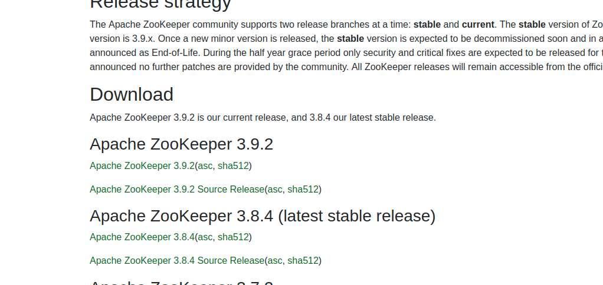
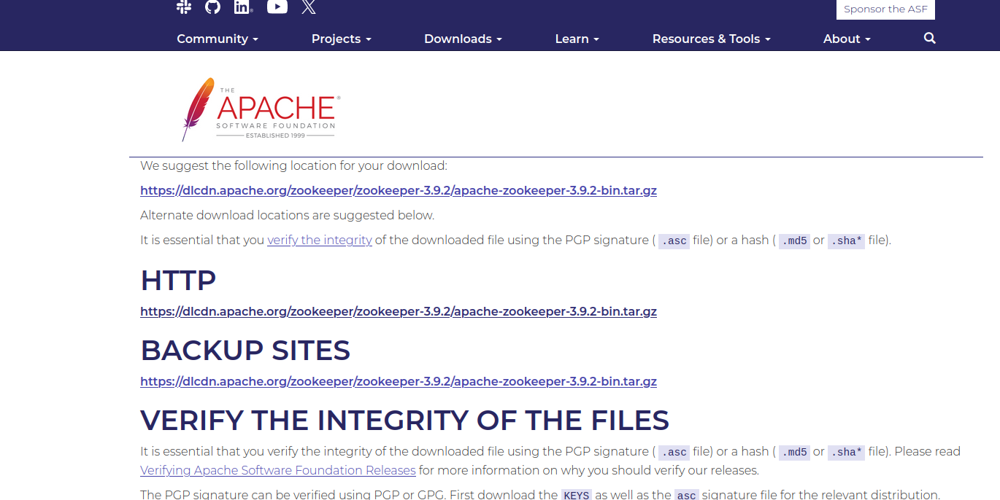

Создаем новую папку для работы и скачиваем установочный архив:
```shell
$ sudo wget https://dlcdn.apache.org/zookeeper/zookeeper-3.9.2/apache-zookeeper-3.9.2-bin.tar.gz
```

Распаковываем:
```shell
$ sudo tar -xvf apache-zookeeper-3.9.2-bin.tar.gz
```

Проверяем, что в файле с настройками раскомментированны нужные строчки и затем сохраняем файл как zoo.cfg (вместо zoo_sample.cfg):
```shell
$ sudo nano zookeeper/conf/zoo_sample.cfg
```
```shell
# The number of milliseconds of each tick
tickTime=2000
# The number of ticks that the initial 
# synchronization phase can take
initLimit=10
# The number of ticks that can pass between 
# sending a request and getting an acknowledgement
syncLimit=5
# the directory where the snapshot is stored.
# do not use /tmp for storage, /tmp here is just 
# example sakes.
dataDir=/tmp/zookeeper
# the port at which the clients will connect
clientPort=2181
# the maximum number of client connections.
# increase this if you need to handle more clients
#maxClientCnxns=60
```

Запускаем сервер zookeeper:
```shell
$ sudo zookeeper/bin/zkServer.sh start

...
Starting zookeeper ... STARTED
```

Можем подключиться к нему:
```shell
$ zookeeper/bin/zkCli.sh -server 127.0.0.1:2181
```

Если все ок, появится статус CONNECTED:
```shell
WatchedEvent state:SyncConnected type:None path:null zxid: -1
[zk: 127.0.0.1:2181(CONNECTED) 0]
```

Выход из сессии командой quit.

Чтобы остановить сервер:
```shell
$ sudo zookeeper/bin/zkServer.sh stop
```

Теперь необходимо превратить Zookeeper в сервис, чтобы не запускать его вручную каждый раз. Создаем файл сервиса для Zookeeper:
```shell
$ sudo nano /etc/systemd/system/zookeeper.service
```

И вставляем туда настройки:
```shell
[Unit]
Description=Zookeeper Daemon
Documentation=http://zookeeper.apache.org
Requires=network.target
After=network.target
[Service]
Type=forking
WorkingDirectory=<путь к папке zookeper>
ExecStart=<путь к папке zookeper>/bin/zkServer.sh start <путь к папке zookeper>/conf/zoo.cfg
ExecStop=<путь к папке zookeper>/bin/zkServer.sh stop<путь к папке zookeper>/conf/zoo.cfg
ExecReload=<путь к папке zookeper>/bin/zkServer.sh restart <путь к папке zookeper>/conf/zoo.cfg
TimeoutSec=30
Restart=on-failure
[Install]
WantedBy=default.target
```

Перезагружаем systemd, чтобы изменения применились:
```shell
$ sudo systemctl daemon-reload
```

Запускаем сервис и добавляем ему автозапуск при запуске системы:
```shell
$ sudo systemctl start zookeeper
$ sudo systemctl enable zookeeper
```

Проверяем, что все работает:
```shell
$ sudo systemctl status zookeeper
● zookeeper.service - Zookeeper Daemon
     Loaded: loaded (/etc/systemd/system/zookeeper.service; enabled; vendor pre>
     Active: active (running) since Fri 2024-04-26 14:19:10 MSK; 2min 54s ago
    ...
```

## Работа с Kafka без Python

Запускаем сервер Kafka:
```shell
$ bin/kafka-server-start.sh config/server.properties
```

Создаем топик, чтобы отправлять в него сообщения:
```shell
$ bin/kafka-topics.sh --create --topic my_test_topic --bootstrap-server localhost:9092

Created topic my_test_topic.
```

Список топиков можно посмотреть следующей командой:
```shell
$ bin/kafka-topics.sh --list --bootstrap-server localhost:9092
```

Запускаем producer — он отправляет сообщения:
```shell
$ bin/kafka-console-producer.sh --topic my_test_topic --bootstrap-server localhost:9092
```

Открываем еще один терминал и запускаем там consumer — получатель сообщений:
```shell
$ bin/kafka-console-consumer.sh --topic my_test_topic --bootstrap-server localhost:9092
```

Получаем передачу событий:
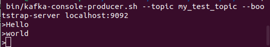
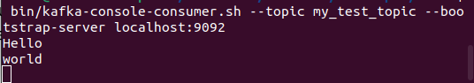

Если запустить producer, отправить в него сообщения, а затем consumer — в нем не отразятся отправленные сообщения. Consumer по умолчанию начинает читать данные с конца топика в тот момент, когда он запустился. Чтобы прочитать сообщения, записанные до запуска consumer — нужно добавить настройку `auto.offset.reset`:
```shell
$ bin/kafka-console-consumer.sh --topic my_test_topic --bootstrap-server localhost:9092 --consumer-property auto.offset.reset=earliest
```
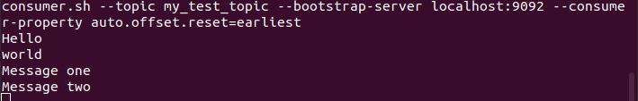

## Чтение сообщений Kafka в Python

При работе с очередями в Kafka надо учитывать два важных нюанса - партиции и оффсет.

Партиции — это фундаментальный механизм хранения данных в Apache Kafka. Каждый топик в Kafka разделен на одну или несколько партиций. Каждая партиция — это упорядоченная и неизменяемая последовательность сообщений, которая хранит данные.

При отправке сообщения в Kafka вы можете указать ключ и определить, в какую партицию отправить сообщение. Это позволяет управлять упорядоченностью данных с одним ключом и предотвращать изменение порядка обработки.

Оффсеты в Kafka — это позиции в партициях, указывающие на конкретные места в потоке сообщений. Оффсеты используются для отслеживания прогресса консьюмеров при чтении данных из топиков.

Оффсеты позволяют консьюмерам запоминать, до какого момента они уже прочитали данные. При перезапуске или сбое консьюмер сможет продолжить чтение с места, где он остановился, а не с начала.
Запускаем сервер Kafka и producer, отправляем в него несколько сообщений. Теперь попробуем считать их и соединить в одно при помощи функции в Python.

```python
# consumer.py

import json
from kafka import KafkaProducer, KafkaConsumer


# Настройки для подключения к Kafka
bootstrap_servers = 'localhost:9092' # адрес Kafka
topic = 'my_test_topic' # тут нужно указать топик

# Создание Kafka-консьюмера
consumer = KafkaConsumer(
   topic,
   bootstrap_servers=bootstrap_servers,
   auto_offset_reset='earliest',  # или 'latest'
   enable_auto_commit=False
)

summary = ''

# Чтение данных из топика Kafka
for message in consumer:
   message_text = message.value.decode()
   summary += ' ' + message_text.strip()
   print('Полное сообщение:\n', summary)

# Закрываем консьюмер
consumer.close()
```

Результат:
```shell
$ bin/kafka-console-producer.sh --topic my_test_topic --bootstrap-server localhost:9092
```
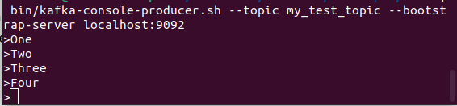
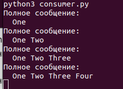


При необходимости, в KafkaConsumer можно добавлять аутентификацию и SSL.

## Отправка сообщений Kafka в Python

Создадим API для отправки данных в очередь. Будем использовать Flask из-за его простоты.

```python
# producer.py

from flask import Flask, request, jsonify
from kafka import KafkaProducer
import json


bootstrap_servers = 'localhost:9092' 
topic = 'my_test_topic'

app = Flask(__name__)

producer = KafkaProducer(bootstrap_servers=bootstrap_servers,
                         value_serializer=lambda v: json.dumps(v).encode('utf-8'))

@app.route('/send_message', methods=['POST'])
def send_message():
    message = request.json.get('message')

    if not message:
        return jsonify({'error': 'Отсутствует сообщение'}), 400

    producer.send(topic, message)  # отправка сообщения
    producer.flush()  # ждем, что сообщение точно отправлено

    return jsonify({'status': 'Сообщение успешно отправлено'}), 200

if __name__ == '__main__':
app.run(debug=True, host='0.0.0.0', port=5000)
```

При отправке POST-запроса на `localhost:5000/send_message` метод считает отправленное сообщение и положит его в очередь Kafka. Запрос отправляем из Postman:
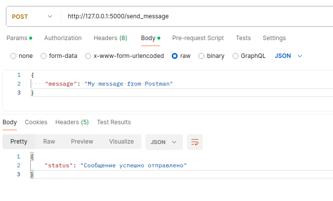

Если параллельно запустить consumer, то в терминале увидим отправленное сообщение:
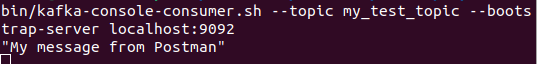

Сообщение выводится с кавычками, так как мы используем сериализатор JSON. Соответственно, подобным образом можно отправлять не только строки, но и JSON с данными.

## Отправка и считывание сообщений с сегментацией

Напишем функцию, разбивающую сообщение на сегменты одинаковой длины. Для ASCII длина будет равна весу сегмента в байтах:

``` python
# producer.py

def segmented_send(message, chunk_size=200):
    try:
        # wrap разбивает сообщение на части равной длины
        for chunk in wrap(message, width=chunk_size):
            producer.send(topic, chunk)
        
        producer.flush()

        return 'OK'

    except Exception as e:
        return str(e)
```

Обновим код метода send_message:
```python
# producer.py

@app.route('/send_message', methods=['POST'])
def send_message():
    message = request.json.get('message')

    if not message:
        return jsonify({'error': 'Отсутствует сообщение'}), 400

    status = segmented_send(message, 100)

    if status != 'OK':
        return jsonify({'error': status}), 500

    return jsonify({'status': 'Сообщение успешно отправлено'}), 200

if __name__ == '__main__':
app.run(debug=True, host='0.0.0.0', port=5000)
```

Отправляем запрос через Postman и видим результат в consumer:
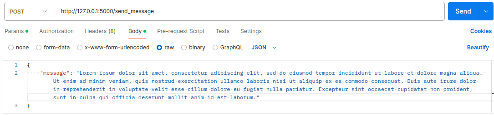
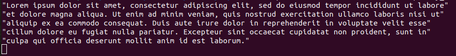

Теперь необходимо считать сегменты из очереди и собрать из них исходное сообщение. Запускаем consumer.py с `auto_offset_reset='latest'`:
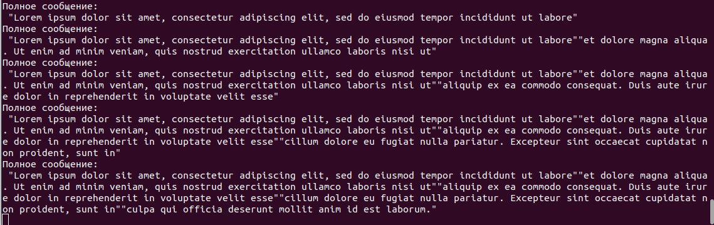

Получаем исходное сообщение, обновляющееся при считывании нового сегмента. При необходимости, consumer тоже можно обернуть в метод и читать накопившуюся очередь раз в промежуток времени.