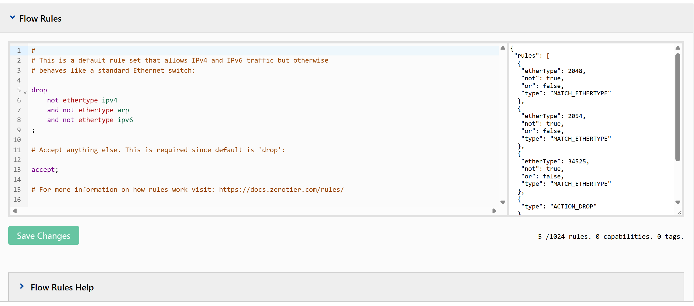

# Методические указания по настройке виртуальной локальной сети ZeroTier

## Оглавление:

1. [Введение](#введение)
2. [Настройка сети ZeroTier](#настройка-сети-zerotier)
3. [Установка ZeroTier One](#установка-zerotier-one)
   3.1. [Windows](#установка-на-windows)
   3.2. [Android](#установка-на-android)
4. [Тестирование связи](#тестирование-связи)

---

### Введение

ZeroTier - компания, предоставляющая услуги для создания и управления виртуальными [программно-управляемыми сетями](https://ru.wikipedia.org/wiki/%D0%9F%D1%80%D0%BE%D0%B3%D1%80%D0%B0%D0%BC%D0%BC%D0%BD%D0%BE-%D0%BE%D0%BF%D1%80%D0%B5%D0%B4%D0%B5%D0%BB%D1%8F%D0%B5%D0%BC%D0%B0%D1%8F_%D1%81%D0%B5%D1%82%D1%8C)

Продукты ZeroTier работают по бизнес-модели freemium, предоставляя свою базовую модель бесплатно.

Базовая модель позволяет иметь одного администратора сети, вплоть до 3 трех виртуальных сетей и вплоть до 10-ти устройств, подключенных к сети.

В данном примере будут использоваться два продукта:

- ZeroTier One - кроссплатформенное клиентское приложение, предоставляющее доступ к виртуальным сетям
- ZerTier Central - веб-портал, предназначенный для администрирования виртуальными сетями

### Настройка сети ZeroTier

Для создания виртуальной сети, сначала необходимо сначала создать аккаунт ZeroTier на [сайте](https://my.zerotier.com/login)

После успешной регистрации, необходимо перейти в [ZeroTier Central](https://my.zerotier.com/)

На данной странице отображаются все созданные вами сети и ограничения вашего аккаунта:


На этом окне создайте новую сеть и перейдите на страницу сети


Каждая сеть, создаваемая в ZeroTier имеет уникальный неизменяемый Network ID с помощью которого можно подключиться к ней.

Для целей данного примера, никакие настройки сети менять не надо. Нас будет интересовать только вкладка Members.

Далее описаны основные настройки доступные настройки сети. Если это вам не важно, можете перейти [сюда](#установка-zerotier-на-windows)

---

#### Вкладка Settings

Во вкладке настроек можно поменять название сети и параметры подключения:

- Private - каждого нового члена администратор должен одобрять
- Public - любой, кто знает Network ID может подключиться к сети.


Так же, при необходимости в разделе Advance, можно поменять ip адреса, выдаваемые подключаемым устройствам, а также настроить маршрутизацию при подключении с zerotier маршрутизаторов ([подробнее](https://docs.zerotier.com/routers/)), настроить DNS, ipv6 и.т.д.

### Вкладка Flow Rules

По умолчанию, zeroTier пропускает весь трафик по протоколам ipv4, ipv6 и arp.

При необходимости можно настроить пропускаемый трафик с помощью простого языка Flow Rules.

В flow rules можно настроить разрешенные протоколы, разрешенные порты для запросов, устройства, отправляющие и получающие запрос и.т.д.


### Установка ZeroTier One

ZeroTier One имеет версии для всех популярный платформ: Windows, Linux Debian and RPM, MacOS, Android, IOS и даже Docker контейнер.

Ссылки на все версии ZeroTier One можно найти [здесь](https://www.zerotier.com/download/)

После установки на ПК ZeroTier запускает два приложения:

- сервис который работает как администратор и выполняет все управление сетью
- приложение которое предоставляет интерфейс в панели задач и не работает как администратор.

Приложение общается с сервисом с помощью секретного ключа, который копируется в систему при установки. Эти конфигурационные файлы находятся в данных локациях:

- Windows: C:\ProgramData\ZeroTier\One
- macOS: /Library/Application Support/ZeroTier/One
- Linux: /var/lib/zerotier-one
- FreeBSD/OpenBSD: /var/db/zerotier-one

Настройки сети, доступные из приложения, можно найти в
networks.d/[network-id].local.conf

```
allowManaged=1
allowGlobal=0
allowDefault=0
allowDNS=0
```

- allowManaged - разрешить ZeroTier настраивать IP адреса и пути для локальных/приватных сетей (работает внутри локальной сети)
- allowGlobal - разрешить ZeroTier настраивать IP адреса и пути для глобальный IP сетей (работает во всей сети интернет)
- allowDefault - разрешить ZeroTier настраивать системные пути по умолчанию
- allowDNS - разрешить ZeroTier устанавливать DNS сервер.

Для данного примера нужно разрешить allowManaged и AllowGlobal. Способ настройки через приложение будет показано далее.

#### Установка на Windows

После установки ZeroTier, у вас в панели задач должна появится иконка ZeroTier


По нажатию на нее откроется меню


Добавьте созданную ранее сеть через кнопку "Join New Network..."


После ввода кода вы не увидите изменений, так как пользователя надо добавить в панели управления ZeroTier Central


Выберите нужного пользователя и нажмите Authorize. Через несколько секунд, обновив список, вы увидите предоставленный устройству IP адрес:


Его так же можно найти в приложении:


Так же, для того, чтобы вы могли общаться с компьютерами вне вашей локальной сети, отметьте данные варианты в приложении:


#### Установка на Android

После установки приложения ZeroTier One на Android, откройте его


Для добавления сети нажмите Add Network и
введите Network ID и не меняйте никакие другие настройки.


Альтернативно можно просканировать QR код, доступный в ZeroTier Central

После добавления сети, включите ее и вы должны получить уведомление о том, что пользователь не авторизован

перейдите в ZeroTier Central и добавьте пользователя аналогично тому, как в примере [Выше](#установка-на-windows)

IP адрес устройства можно найти, нажав на сеть и открыв ее статус

Так же, для работы без подключения wi-fi, в настройках включите использование мобильных данных

### Тестирование связи

После добавления более чем одного устройства, вы можете проверить достижимость устройств с помощью команды ping

Для Android, если ping от устройства Windows не доходят, необходимо сначала сделать ping с Android на другое устройство. Для этого можно установить приложение [ConnectBot](https://connectbot.org/) и создать в нем новую локальную консоль

Затем в этой консоли можете провести ping до IP адреса другого устройства. После успешного ping на Android можeте со второго устройства проверить ping до Android


После успешного ping можно проверить достижимость по IP адресу локально развернутого сервера


Теперь можете поменять все ip адреса запросов прикладного, канального и транспортного уровня на ip адреса в виртуальной локальной сети ZeroTier
