# Методические указания по разработке Прикладного уровня

## Оглавление:

1. Введение
2. Запуск фронтенда и страница авторизации
3. Вебсокет сервер
4. Функционал чата
5. HTTP метод для транспортного уровня
6. Postman

---

### Введение

Уровень будет включать в себя React-приложение для чата и Web-Socket сервер для связи с бекендом

Для разработки понадобится среда исполнения NodeJS и пакетный менеджер npm.

Создадим пустой проект, и в нем - две папки:

- Frontend (здесь будет фронтенд на реакте)
- WebSocketServer (здесь будет веб-сокет сервер)

---

### Запуск фронтенда и страница авторизации

Перейдем в папку Frontend и выполним в ней `npx create-react-app . --template typescript` для инициализации
реакт-приложения в
текущей директории.

Получим ошибку:

```
Cannot create a project named "Frontend" because of npm naming restrictions:
* name can no longer contain capital letters
Please choose a different project name.
```

Поэтому переименуем папку в frontend с маленькой буквы.

Еще раз запустим команду `npx create-react-app . --template typescript`. В этот раз должно получиться.

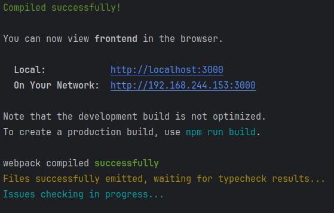

Создалось две папки - public и src, и в них довольно много файлов, нам столько не нужно. Понадобятся файлы:

- public/index.html
- src/App.css
- src/App.tsx
- src/index.css
- src/index.tsx

Остальные файлы в этих папках можно удалять.

Кстати, не забыли сделать `npm install` в папке frontend? Самое время! И не забудьте добавить node_modules и
package-lock.json в .gitignore)

В нужных нам файлах тоже много чего лишнего, поэтому оставим только то что нужно:

**public/index.html**

```html
<!DOCTYPE html>
<html lang="en">
  <head>
    <meta charset="utf-8" />
    <meta name="viewport" content="width=device-width, initial-scale=1" />
    <meta name="theme-color" content="#000000" />
    <meta
      name="description"
      content="Web site created using create-react-app"
    />
    <title>Messenger</title>
  </head>
  <body>
    <noscript>You need to enable JavaScript to run this app.</noscript>
    <div id="root"></div>
  </body>
</html>
```

**src/App.tsx**

```typescript jsx
import React from 'react';
import './App.css';

function App() {
  return (
    <div className="App">
      <header className="App-header">
        <p>
          Edit <code>src/App.tsx</code> and save to reload.
        </p>
        <a
          className="App-link"
          href="https://reactjs.org"
          target="_blank"
          rel="noopener noreferrer"
        >
          Learn React
        </a>
      </header>
    </div>
  );
}

export default App;
```

**src/App.css**

```css
.App {
  display: flex;
  justify-content: center;
  text-align: center;
  background-color: #19191A;
  color: white;
  height: 100%;
}
```

**src/index.tsx**

```typescript jsx
import React from 'react';
import ReactDOM from 'react-dom/client';
import './index.css';
import App from './App';

const root = ReactDOM.createRoot(
  document.getElementById('root') as HTMLElement
);
root.render(
  <React.StrictMode>
    <App />
  </React.StrictMode>
);
```

Проверяем, что все запускается `npm run start`


Приложение будет состоять из страницы авторизации и чата. Для такого небольшого приложения использовать роутинг не будем
(хотя в более крупных проектах он необходим - очень улучшает UX и в целом делает код более удобным).

В проекте будем использовать библиотеку Material UI - она позволит импортировать уже стилизованные компоненты, что ускорит
разработку нашего проекта (ведь писать стили это довольно долгое занятие).

`npm install @mui/material @emotion/react @emotion/styled`

Теперь при каждом использовании компонентов необходимо будет просто ипортировать их в топе файла:

```typescript jsx
import {TextField} from '@mui/material';
```

Определимся со структурой проекта. В папке src будут исходники нашего приложения - стор, страницы, компоненты.

Создадим папку src/components/ - здесь будут находится наши компоненты для верстки.
Внутри создадим папки и файлы для компонентов:

- Login/
  - Login.css
  - Login.tsx

Теперь давайте отрисуем страницу авторизации (Login). Пока без функционала. Просто страница с версткой.

**Login.tsx**

```typescript jsx
export const Login = () => {

  return (
    <>
      <div className="login">
        <div className="login--card">
          <div className="login--header">Вход</div>

          <TextField id="outlined-basic" label="Введите имя" variant="outlined"
            className="login--input"
          />

          <Button variant="contained">
            Войти
          </Button>

        </div>
      </div>
    </>
  );
}
```

И добавим немного стилей. Будем писать стили по методологии БЭМ:

блок--элемент--модификатор (или можно еще блок--элемент__модификатор - как вам удобнее)

Это распросраненная методология определения классов для компонентов верстки. Позволяет довольно удобно выделять логические
блоки в верстке. Еще очень помогает, когда необходимо повесить много стилей на какие то компоненты - убирает лишний код
из html (jsx) верстки. Улучшает переиспользуемость компонентов.

**Login.css**

```css
.login {
  display: flex;
  justify-content: center;
  align-items: center;
  width: 100%;
  height: 100%;
}

.login--card {
  background-color: #323232;
  width: 25%;
  padding: 5em;
  border-radius: 20px;
  display: flex;
  flex-direction: column;
  gap: 3em;
}

.login--input {
  color: white;
}

.login--header {
  font-size: 2em;
  font-weight: bold;
}
```

Добавим компонент в наше приложение:

**App.tsx**

```typescript jsx
import React from 'react';

function App() {
  return (
    <>
      <div className="App">
        <Login/>
      </div>
    </>
  );
}

export default App;
```

Проверим как выглядит наша страница авторизации:

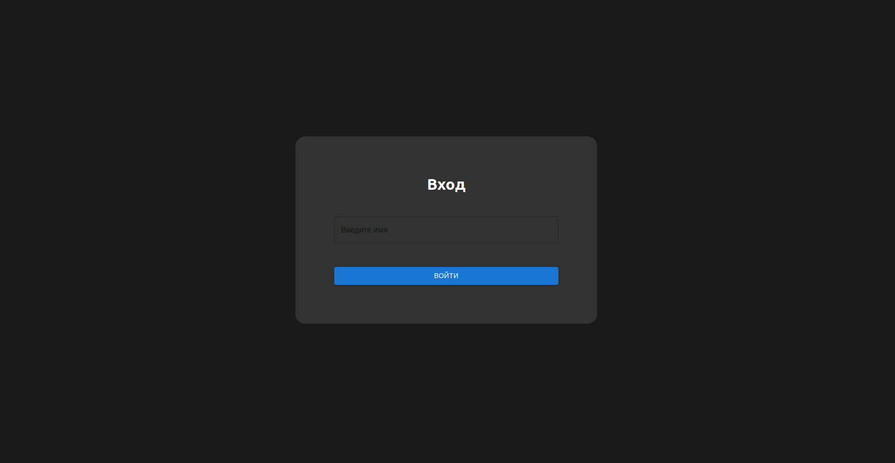

Супер! Начало верстки положено. Теперь надо бы добавить функционал для нашего приложения - перейдем к вебсокет-серверу.

---

### Вебсокет сервер

Перейдем в папку WebSocketServer, создадим там файл index.ts

Для запуска typescript файлов понадобится собственно typescript и движок для него ts-node.
Установите их командами:

Либо локально для проекта:

- `npm install -D typescript`
- `npm install -D ts-node`

Либо глобально:

- `npm install -g typescript`
- `npm install -g ts-node`

В папке WebSocketServer также инициализируем npm проект:

- `npm init`

Перейдем в файл index.ts. Импортируем пакеты для сервера:

```typescript
import express from 'express'
import axios from 'axios'
import http from 'http'
import ws, {type WebSocket} from 'ws'
```

Не забудьте импортировать пакеты как npm-зависимости через `npm install ...`

Если сервер не будет запускаться или будут проблемы с зависимостями, можете подтянуть в package.json
разделы dependencies и devDependencies как у меня и сделать `npm install`.

```
"dependencies": {
  "@reduxjs/toolkit": "^2.2.1",
    "arg": "^5.0.2",
    "axios": "^1.6.7",
    "express": "^4.18.2",
    "react-redux": "^9.1.0",
    "swagger-autogen": "^2.23.7",
    "swagger-ui-express": "^5.0.0",
    "ws": "^8.16.0"
},
"devDependencies": {
  "@types/express": "^4.17.21",
    "@types/swagger-ui-express": "^4.1.6",
    "@types/ws": "^8.5.10",
    "@typescript-eslint/eslint-plugin": "^6.21.0",
    "eslint": "^8.57.0",
    "eslint-config-standard-with-typescript": "^43.0.1",
    "eslint-plugin-import": "^2.29.1",
    "eslint-plugin-n": "^16.6.2",
    "eslint-plugin-promise": "^6.1.1",
    "ts-node": "^10.9.2",
    "typescript": "^5.4.5"
}
```

В файле index.ts объявим несколько констант:

```typescript
const port: number = 8001; // порт на котором будет развернут этот (вебсокет) сервер
const hostname = 'localhost'; // адрес вебсокет сервера
const transportLevelPort = 8002; // порт сервера транспортного уровня
const transportLevelHostname = '192.168.12.172'; // адрес сервера транспортного уровня
```

Объявим тип MessageCard для описания сообщений. В нем будет содержаться id сообщения, имя пользователя, который
отправил сообщение, время отправки, текст и признак ошибки (дошло ли сообщение)

```typescript
interface MessageCard {
  id?: number
  username: string
  data?: string
  send_time?: string
  error?: string
}
```

В записи о пользователе будет id пользователя и вебсокет-соединение

```typescript
type Users = Record<string, Array<{
  id: number
  ws: WebSocket
}>>
```

Теперь создадим сам сервер:

```typescript
const app = express(); // создание экземпляра приложения express
const server = http.createServer(app); // создание HTTP-сервера

// Используйте express.json() для парсинга JSON тела запроса
app.use(express.json());

// запуск сервера приложения
server.listen(port, hostname, () => {
  console.log(`Server started at http://${hostname}:${port}`)
})
```

Создадим вебсокет сервер и юзеров, которые будут к нам подключаться:

```typescript
const wss = new ws.WebSocketServer({server})
const users: Users = {}
```

Теперь опишем само вебсокет соединение. Линтер может выбрасывать предупреждения, но работать будет,
так что игнорируем некоторые строчки.

```typescript
// обрабочик на коннект для вебсокета
wss.on('connection', (websocketConnection: WebSocket, req: Request) => {
  if (req.url.length === 0) {
    console.log(`Error: req.url = ${req.url}`)
    return
  }
  // eslint-disable-next-line @typescript-eslint/ban-ts-comment
  // @ts-expect-error
  const url = new URL(req?.url, `http://${req.headers.host}`)
  const username = url.searchParams.get('username') // берем имя юзера из параметра

  if (username !== null) {
    console.log(`[open] Connected, username: ${username}`)

    if (username in users) {
      users[username] = [...users[username], {id: users[username].length, ws: websocketConnection}]
    } else {
      users[username] = [{id: 1, ws: websocketConnection}]
    }
  } else {
    console.log('[open] Connected')
  }

  console.log('users collection', users)

  // обработчик на закрытие
  websocketConnection.on('close', (event: any) => {
    console.log(username, '[close] Соединение прервано', event)

    delete users.username
  })
})
```

На каждый запрос на новое вебсокет соединение будем добавлять нового пользователя в нащ список и подпишем его на событие
'close' когда соединение закрывается.

На событие 'close' будем удалять пользователя из списка.

Если запутались в коде, вот еще раз полный пример файла:

```typescript
import express from 'express';
import axios from 'axios';
import http from 'http';
import ws, {type WebSocket} from 'ws';

const port: number = 8001; // порт на котором будет развернут этот (вебсокет) сервер
const hostname = 'localhost'; // адрес вебсокет сервера
const transportLevelPort = 8002; // порт сервера транспортного уровня
const transportLevelHostname = '192.168.12.172'; // адрес сервера транспортного уровня

interface MessageCard {
  id?: number
  username: string
  data?: string
  send_time?: string
  error?: string
}

type Users = Record<string, Array<{
  id: number
  ws: WebSocket
}>>

const app = express() // создание экземпляра приложения express
const server = http.createServer(app) // создание HTTP-сервера

// Используйте express.json() для парсинга JSON тела запроса
app.use(express.json())

// запуск сервера приложения
server.listen(port, hostname, () => {
  console.log(`Server started at http://${hostname}:${port}`)
})

const wss = new ws.WebSocketServer({server})
const users: Users = {}

// обрабочик на коннект для вебсокета
wss.on('connection', (websocketConnection: WebSocket, req: Request) => {
  if (req.url.length === 0) {
    console.log(`Error: req.url = ${req.url}`)
    return
  }
  // eslint-disable-next-line @typescript-eslint/ban-ts-comment
  // @ts-expect-error
  const url = new URL(req?.url, `http://${req.headers.host}`)
  const username = url.searchParams.get('username') // берем имя юзера из параметра

  if (username !== null) {
    console.log(`[open] Connected, username: ${username}`)

    if (username in users) {
      users[username] = [...users[username], {id: users[username].length, ws: websocketConnection}]
    } else {
      users[username] = [{id: 1, ws: websocketConnection}]
    }
  } else {
    console.log('[open] Connected')
  } 

  // обработчик на закрытие
  websocketConnection.on('close', (event: any) => {
    console.log(username, '[close] Соединение прервано', event)

    delete users.username
  })
})
```

Еще необходимо добавить в проект (в папку WebSocketServer) файл `tsconfig.json` - в нем будут описаны конфигурации для
сборки проекта:

```json
{
  "compilerOptions": {
    "target": "ES6",
    "module": "CommonJS",
    "sourceMap": true,
    "esModuleInterop": true,
    "strictNullChecks": true
  }
}
```

Выполняем `ts-node index.ts`, сервер должен запуститься и в консоли должна появиться надпись
**Server started at http://localhost:8001** - сервер запустился на порту 8001

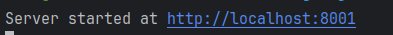

На фронтенде добавим страницу с чатом. Когда пользователь будет авторизоваться, для него откроется вебсокет-соединение,
и его редиректнет на страницу с чатом.

Добавим в папку frontend/src/components/ файлы:

- Chat/
  - Chat.css
  - Chat.tsx
- Input/
  - Input.css
  - Input.tsx

Chat - наша основная страница. А компонент Input будет отвечать за инпут-поле, в которое пользователь будет писать 
сообщения. Считается хорошей практикой делить приложение на компоненты, которые должны отвечать за определенный функционал.
Например наш Input будет отвечать за ввод сообщений, а в будущем мы добавим компонент MessageCard, который будет представлять
собой карточку с сообщением пользователя.

Пока что наш чат не будет отправлять сообщение. Просто проверим работу вебсокет сервера - при авторизации пользователя
должно открыться соедиение.

В компоненте чата будет реализована логика логаута - чистим стор при выходе юзера. Здесь же будет отображаться массив
карточек-сообщений, и еще инпут для ввода сообщений.

Важный момент! Перед каждым react-компонетом мы будем объявлять какие параметры он принимает - typescript постоянно
следит за нами и не допустит нетипизированных мест, а мы не запутаемся в параметрах компонента.

**Chat.tsx**

```typescript jsx
import {useUser} from "../../hooks/useUser";
import {Message} from "../../consts";
import {Input} from "../Input/Input";
import {MessageCard} from "../MessageCard/MessageCard";
import {Button} from "@mui/material";
import React from "react";

type ChatProps = {
  ws: WebSocket | undefined;
}

export const Chat: React.FC<ChatProps> = ({ws}) => {
  const {login, resetUser} = useUser();

  // при логауте закрываем соединение
  const handleClickLogoutBtn = () => {
    resetUser();
    if (ws) {
      ws.close(4000, login);
    } else {
      console.log("ws.close(4000, 'User logout'); don't work");
    }
  };

  return (
    <>
      <div className="chat">
        <div className="chat--header">
          {/* имя нашего пользователя */}
          Сообщения от {login}
        </div>

        <div className="chat--body">
          {/* здесь в будущем будут находиться карточки с сообщениями */}
        </div>

        <Input ws={ws} setMessageArray={setMessageArray}/>
      </div>

        <Button variant="contained"
                onClick={handleClickLogoutBtn}
                style={{
                  height: 'fit-content',
                  margin: '1em'
                }}
        >
          Выход
        </Button>
    </>
  );
}
```

**Chat.css**

```css
.chat {
  background-color: #323232;
  height: 100%;
  width: 50%;
}

.chat--header {
  width: 100%;
  padding: 1em;
  border-bottom: #19191A solid 1px;
}

.chat--container {
  overflow-y: auto;
  height: 85vh;
}
```

**Input.tsx**

```typescript jsx
import React, {useState} from "react";
import {useUser} from "../../hooks/useUser";
import {Message} from "../../consts";
import {Button, TextField} from "@mui/material";

export const Input = () => {
  return (
    <>
      <div className="chat-input">
        <input className="chat--input"
          placeholder="Введите сообщение"
          style={{width: '100%'}}
        />
        <Button variant="contained"
                style={{
                  margin: '0 2em',
                  padding: '0 2em',
                }}
        >
          Отправить
        </Button>
      </div>
    </>
  );
}
```

**Input.css**

```css
.chat-input {
  display: flex;
  height: 3em;
  position: fixed;
  bottom: 1em;
  width: 50%;
  padding-left: 1em;
}

.chat--input {
  background-color: #505051;
  border: none;
  border-radius: 0.5em;
}
```

Для того, чтобы при перезагрузке пользователя не разлогинивало, можем воспользоваться Redux с персистентным 
хранилищем - данные о пользователе будут храниться в localStorage и не чиститься после перезагрузки.

Установим redux-toolkit: `npm install @reduxjs/toolkit react-redux redux-persist`

Создадим папку store, и в ней файлы:

- index.ts - файл для экспорта всего необходимого
- store.ts - здесь будет описано хранилище
- types.ts - тут будут объявлены типы для стора
- userSlice.ts - слайс, в котором будет храниться информация о пользователе

Конфигурация файлов довольно стандартная для редакса:

**index.ts**

```typescript
export { store } from './store'; // экспортируем экземпляр стора, чтобы потом брать из него что-то
```

**store.ts**

```typescript
import { configureStore, combineReducers } from '@reduxjs/toolkit';
import userSlice from './userSlice';
import { persistReducer, persistStore } from 'redux-persist';
import storage from 'redux-persist/lib/storage';

// конфиг для нащщего стора
const persistConfig = {
  key: 'root',
  storage,
};

const rootReducer = combineReducers({
  user: userSlice,  // стор состоит из одного слайса
});

// создаем редьюсера
const persistedReducer = persistReducer(persistConfig, rootReducer);

// конфигурирем стор 
export const store = configureStore({
  reducer: persistedReducer,

  middleware: (getDefaultMiddleware) =>
    getDefaultMiddleware({
      serializableCheck: false,
    }),
});

export const persistor = persistStore(store); // стор персистентный, чтобы данные сохранялись в localStorage
```

**types.ts**

```typescript
import type { store } from './store';

export type RootState = ReturnType<typeof store.getState>;
export type AppDispatch = typeof store.dispatch;
```

**userSlice.ts**

```typescript
import { createSlice } from '@reduxjs/toolkit';

const initialState = {
  login: '',  // все что нужно знать о пользователе - его логин 
};

const dataSlice = createSlice({
  name: 'user',
  initialState: { 
    Data: initialState 
  },
  
  reducers: {
    setData(state, { payload }) {
      state.Data = payload.Data;  // будем сеттить юзера при логине
    },
    
    cleanUser: (state) => {
      state.Data.login = '';  // чистим логин юзера когда он выйдет
    },
  },
});

export const { 
  setData: setUserDataAction, 
  cleanUser: cleanUserDataAction 
} = dataSlice.actions;

export default dataSlice.reducer;
```

Теперь подумаем, как можно обращаться к хранилищу для получения информации о юзере. Хорошей практикой считается
использовать для этого кастомные хуки. Давайте создадим папку hooks и в ней файл useUser.ts - назовем файл как наш хук
(а любой хук, как известно, начинается с префикса use).

```typescript
import { useDispatch, useSelector } from 'react-redux';
import {
  setUserDataAction,
  cleanUserDataAction,
} from '../store/userSlice';
import { RootState } from '../store/types';

type State = {
  userInfo: {
    Data: {
      login: string;
    };
  };
};

export const useUser = () => {
  const { Data } = useSelector((state: RootState) => state.user);
  
  const { login } = Data; // возьмем у юзера логин
  
  const dispatch = useDispatch();

  const setUser = (value: State) => { // метод для загрузки логина юзера в стор
    dispatch(setUserDataAction(value.userInfo));
  };

  const resetUser = () => { // метод для чистки слайса
    dispatch(cleanUserDataAction());
  };

  return {
    login,
    setUser,
    resetUser,
  };
};
```

Поправьте index.tsx для работы со стором:

```typescript jsx
import React from 'react';
import ReactDOM from 'react-dom/client';
import './index.css';
import App from './App';
import {store} from "./store";
import { Provider } from 'react-redux';

const root = ReactDOM.createRoot(
  document.getElementById('root') as HTMLElement
);
root.render(
  <Provider store={store}>
    <App />
  </Provider>,
);
```

И обновим файл Login.tsx. Будем открывать вебсокет соединение при логине.


**Login.tsx**

```typescript jsx
import React, {useState} from "react";
import {useUser} from "../../hooks/useUser";
import {Button, TextField} from '@mui/material';
import {hostname} from "../../consts";

type LoginProps = {
  ws: WebSocket | undefined;
  setWs: (ws: WebSocket | undefined) => void;
  createWebSocket: (url: string) => WebSocket | undefined;
}

export const Login: React.FC<LoginProps> = ({ws, setWs, createWebSocket}) => {
  const {login, setUser} = useUser();
  const [userName, setUsername] = useState(login);

  const handleChangeLogin = (event: any) => {
    setUsername(event.target.value);
  };

  // при авторизации регистрируем новое вебсокет соединеие
  const handleClickSignInBtn = () => {
    setUser({
      userInfo: {
        Data: {
          login: userName,
        },
      },
    });
    if (ws) {
      ws.close(1000, 'User enter userName');
    } else {
      console.log('ws.close(1000, User enter userName); dont work');
    }
    setWs(
      createWebSocket(
        `ws://${hostname}:8081/?username=${encodeURIComponent(userName)}`,
      ),
    );
  };

  return (
    <>
      <div className="login">
        <div className="login--card">
          <div className="login--header">Вход</div>

          <TextField id="outlined-basic" label="Введите имя" variant="outlined"
            className="login--input"
            value={userName}
            onChange={handleChangeLogin}
          />

          <Button variant="contained"
                  onClick={handleClickSignInBtn}
          >
            Войти
          </Button>

        </div>
      </div>
    </>
  );
}
```

Давайте проверим, что при логине у пользователя открывается вебсокет-соединение и он добавляется в коллекцию 
пользователей на сервере:

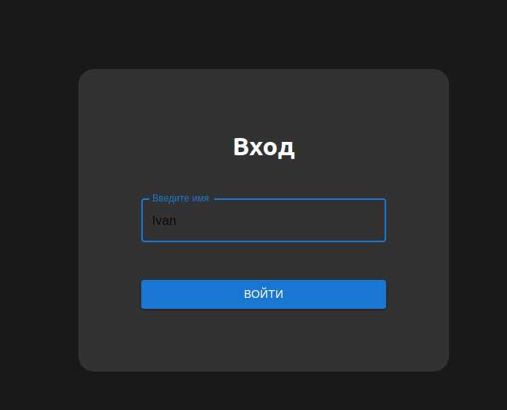
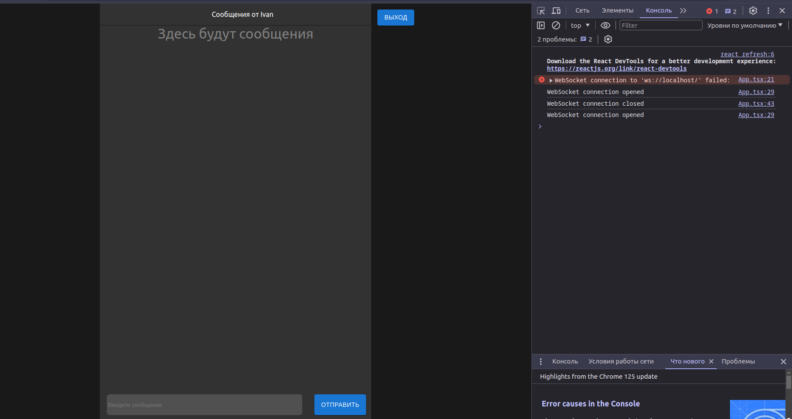
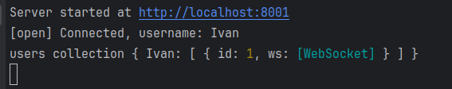
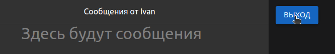
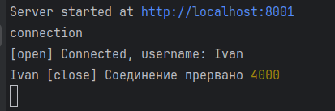

---

### Функционал чата

Осталось сделать отправку и получение сообщений. Займемся их отрисовкой на фронте

в папке src создадим файл consts.ts - здесь будут константы и модельки

```typescript
export const hostname = 'localhost';

export type Message = {
  id?: number;
  username?: string;
  data?: string;
  send_time?: string;
  error?: string;
};
```

Внутри src/components/ создадим папку и файлы для карточки сообщения:

- MessageCard
  - MessageCard.css
  - MessageCard.tsx

В приложении будут два компонента, отвечающие за страницы - Login и Chat.

**App.tsx**

```typescript jsx
import React, {useEffect, useState} from 'react';
import './App.css';
import {useUser} from "./hooks/useUser";
import {Login} from "./components/Login/Login";
import {hostname, Message} from "./consts";
import {Chat} from "./components/Chat/Chat";

function App() {
  const {login} = useUser();
  const [ws, setWs] = useState<WebSocket | undefined>();  // весокет
  const [messageArray, setMessageArray] = useState<Message[]>([]);

  // создание вебсокета должно быть после рендера - поместим в useEffect
  useEffect(() => {
    if (login) {
      setWs(
        createWebSocket(
          `ws://${hostname}:8001/?username=${encodeURIComponent(login)}`,
        ),
      );
    } else {
      setWs(new WebSocket(`ws://${hostname}`));
    }
  }, []);

  // создаем вебсокет
  const createWebSocket = (url: string) => {
    const ws = new WebSocket(url); // создаем новый инстанс

    // обработчик на открытие соединения
    ws.onopen = function () {
      console.log('WebSocket connection opened');
    };
    
    // обработчик на получение сообщения 
    ws.onmessage = function (event) {
      const msgString = event.data;
      const message = JSON.parse(msgString); // парсим

      console.log('MessageCard from server:', message);

      // сеттим сообщение в массив
      setMessageArray((currentMsgArray: Message[]) => [...currentMsgArray, message]);
    };

    // обработчик на закрытие
    ws.onclose = function () {
      console.log('WebSocket connection closed');
    };

    // обработчик на ошибку
    ws.onerror = function (event) {
      console.error('WebSocket error:', event);
    };

    return ws;
  };

  // дальше будут две страницы - с чатом и авторизацией
  return (
    <>
      <div className="App">
        {login ?
          <Chat messages={messageArray} ws={ws} messageArray={messageArray} setMessageArray={setMessageArray}/>
          :
          <Login ws={ws} setWs={setWs} createWebSocket={createWebSocket}/>
        }
      </div>
    </>
  );
}

export default App;
```

Добавим немного стилей:

**App.css**

```css
.App {
  display: flex;
  justify-content: center;
  text-align: center;
  background-color: #19191A;
  color: white;
  height: 100%;
}
```

В чате добавим карточки сообщений.

**Chat**

```typescript jsx
import {useUser} from "../../hooks/useUser";
import {Message} from "../../consts";
import {Input} from "../Input/Input";
import {MessageCard} from "../MessageCard/MessageCard";
import {Button} from "@mui/material";
import React from "react";

type ChatProps = {
  messages: Message[];
  ws: WebSocket | undefined;
  messageArray: Message[];
  setMessageArray: (msg: Message[]) => void;
}

export const Chat: React.FC<ChatProps> = ({messages, ws, messageArray, setMessageArray}) => {
  const {login, resetUser} = useUser();

  // при логауте закрываем соединение
  const handleClickLogoutBtn = () => {
    resetUser();
    if (ws) {
      ws.close(4000, login);
    } else {
      console.log("ws.close(4000, 'User logout'); don't work");
    }
  };

  return (
    <>
      <div className="chat">
        <div className="chat--header">
          Сообщения от {login}
        </div>

        <div className="chat--body">
          {messageArray.length > 0 ?
            <div className="chat--container">
              {messageArray.map((msg: Message, index: number) => (
                <div key={index} className="chat--msg">
                  <MessageCard msg={msg}/>
                </div>
              ))}
            </div>
            :
            <div className="chat--no-msg">
              <div style={{fontSize: '2em', color: 'gray'}}>Здесь будут сообщения</div>
            </div>
          }
        </div>

        <Input ws={ws} setMessageArray={setMessageArray}/>
      </div>

        <Button variant="contained"
                onClick={handleClickLogoutBtn}
                style={{
                  height: 'fit-content',
                  margin: '1em'
                }}
        >
          Выход
        </Button>
    </>
  );
}
```

В карточке будем отображать информацию о сообщении - имя пользователя, дату отправки сообщения и само сообщение.
В зависимости от того, отправил ли наш пользователь сообщение или же другой, будем менять стили карточки.
Для нашего пользователя будет голубой фон, и сообщение будет находиться справа. Если же это сообщение от другого пользователя,
фон будет серым, а сообщение будет находиться слева. 

**MessageCard.tsx**

```typescript jsx
import React from "react";
import {useUser} from "../../hooks/useUser";
import {Message} from "../../consts";

type MessageProps = {
  msg: Message;
}

export const MessageCard: React.FC<MessageProps> = ({msg}) => {
  const {login} = useUser();

  // функция для форматирования времени, чтобы оно красиво отображалось 
  function formatTime(isoDateTime: string | number | Date) {
    const dateTime = new Date(isoDateTime);
    return dateTime.toLocaleString('en-US', {
      timeZone: 'UTC',
      hour: 'numeric',
      minute: 'numeric',
      second: 'numeric',
      hour12: false
    });
  }

  return (
    <>
      <div className={`${msg.username === login ? "msg--own" : "msg--alien"} msg--container`}>
        <div className={`${msg.username === login ? "msg--own--reverse" : "msg--alien--reverse"} msg`}>
          <div className="msg--service">
            <div>
              {msg.username ?? 'Аноним'}
            </div>
            <div style={{color: 'gray', marginLeft: '1em'}}>
              {formatTime(msg.send_time ?? String(new Date()))}
            </div>
          </div>

          {msg.error ?
            <div style={{color: 'gray'}}>Ошибка при отправке: {msg.error}</div>
            :
            <div className={`msg--text ${msg.username === login ? "msg--bg--own" : "msg--bg--alien"}`}>{msg.data}</div>
          }
        </div>
      </div>
    </>
  );
}
```

**MessageCard.css**

```css
.msg--container {
  width: 100%;
  display: flex;
}

.msg--own {
  justify-content: end;
}

.msg--alien {
  justify-content: start;
}

.msg {
  max-width: 60%;
  padding: 1em;
  display: flex;
  flex-direction: column;
}

.msg--own--reverse {
  align-items: end;
}

.msg--alien--reverse {
  align-items: start;
}


.msg--service {
  display: flex;
  width: 100%;
  margin-bottom: 0.5em;
}

.msg--text {
  width: fit-content;
  padding: 0.5em 1em;
  border-radius: 0.5em;
  display: flex;
  justify-content: start;
}

.msg--bg--own {
  background-color: #1565c0;
}

.msg--bg--alien {
  background-color: gray;
}
```

Для инпута реализуем логику для написания и отправки сообщения.

**Input.tsx**

```typescript jsx
import React, {useState} from "react";
import {useUser} from "../../hooks/useUser";
import {Message} from "../../consts";
import {Button, TextField} from "@mui/material";

type InputProps = {
  ws: any,
  setMessageArray: any,
}

export const Input: React.FC<InputProps> = ({ws, setMessageArray}) => {
  const {login} = useUser();
  const [message, setMessage] = useState<Message>({data: ''});

  // в инпуте делаем обработчик на изменение состояния инпута
  const handleChangeMessage = (event: any) => {
    const newMsg: Message = {
      data: event.target.value,
      username: login,
      send_time: String(new Date()),
    };
    setMessage(newMsg);
  };

  // на кнопку Отправить мы должны посать сообщение по вебсокету 
  const handleClickSendMessBtn = () => {
    if (login && ws) {
      message.send_time = '2024-02-23T13:45:41Z';
      const msgJSON = JSON.stringify(message);
      ws.send(msgJSON);
      setMessageArray((currentMsgArray: any) => [...currentMsgArray, message]);
    }
  };

  return (
    <>
      <div className="chat-input">
        <input className="chat--input"
          placeholder="Введите сообщение"
          value={message.data}
          onChange={handleChangeMessage}
          style={{width: '100%'}}
        />
        <Button variant="contained"
                onClick={handleClickSendMessBtn}
                style={{
                  margin: '0 2em',
                  padding: '0 2em',
                }}
        >
          Отправить
        </Button>
      </div>
    </>
  );
}
```

---

На сервере добавляем методы для отправки сообщений всем пользователям в коллекции.

Метод для отправки сообщений пользователям:

```typescript
function sendMessageToOtherUsers(username: string, message: MessageCard): void {
  const msgString = JSON.stringify(message) // сериализуем сообщение
  for (const key in users) {  // рассылаем всем юзерам
    console.log(`[array] key: ${key}, users[keys]: ${JSON.stringify(users[key])} username: ${username}`)
    if (key !== username) {   // кроме нашего юзера
      users[key].forEach(element => {
        element.ws.send(msgString)
      })
    }
  }
}
```

А вот так будет выглядеть файл целиком (вдруг запутались)

```typescript
import express from 'express';
import axios from 'axios';
import http from 'http';
import ws, { type WebSocket } from 'ws';

const port: number = 8001; // порт на котором будет развернут этот (вебсокет) сервер
const hostname = 'localhost'; // адрес вебсокет сервера
const transportLevelPort = 8002; // порт сервера транспортного уровня
const transportLevelHostname = '192.168.12.172'; // адрес сервера транспортного уровня

interface Message {
  id?: number
  username: string
  data?: string
  send_time?: string
  error?: string
}

type Users = Record<string, Array<{
  id: number
  ws: WebSocket
}>>

const app = express() // создание экземпляра приложения express
const server = http.createServer(app) // создание HTTP-сервера

// Используйте express.json() для парсинга JSON тела запроса
app.use(express.json())

app.post('/receive', (req: { body: Message }, res: { sendStatus: (arg0: number) => void }) => {
  const message: Message = req.body
  sendMessageToOtherUsers(message.username, message)
  res.sendStatus(200)
})

// запуск сервера приложения
server.listen(port, hostname, () => {
  console.log(`Server started at http://${hostname}:${port}`)
})

const wss = new ws.WebSocketServer({ server })
const users: Users = {}

function sendMessageToOtherUsers (username: string, message: Message): void {
  const msgString = JSON.stringify(message)
  for (const key in users) {
    console.log(`[array] key: ${key}, users[keys]: ${JSON.stringify(users[key])} username: ${username}`)
    if (key !== username) {
      users[key].forEach(element => {
        element.ws.send(msgString)
      })
    }
  }
}

wss.on('connection', (websocketConnection: WebSocket, req: Request) => {
  if (req.url.length === 0) {
    console.log(`Error: req.url = ${req.url}`)
    return
  }
  // eslint-disable-next-line @typescript-eslint/ban-ts-comment
  // @ts-expect-error
  const url = new URL(req?.url, `http://${req.headers.host}`)
  const username = url.searchParams.get('username')

  if (username !== null) {
    console.log(`[open] Connected, username: ${username}`)

    if (username in users) {
      users[username] = [...users[username], { id: users[username].length, ws: websocketConnection }]
    } else {
      users[username] = [{ id: 1, ws: websocketConnection }]
    }
  } else {
    console.log('[open] Connected')
  }

  console.log('users collection', users)

  websocketConnection.on('message', (messageString: string) => {
    console.log('[message] Received from ' + username + ': ' + messageString)

    const message: Message = JSON.parse(messageString)
    message.username = message.username ?? username
    sendMessageToOtherUsers(message.username, message)
  })

  websocketConnection.on('close', (event: any) => {
    console.log(username, '[close] Соединение прервано', event)

    delete users.username
  })
})
```

Проверяем, что сообщения получают все пользователи:

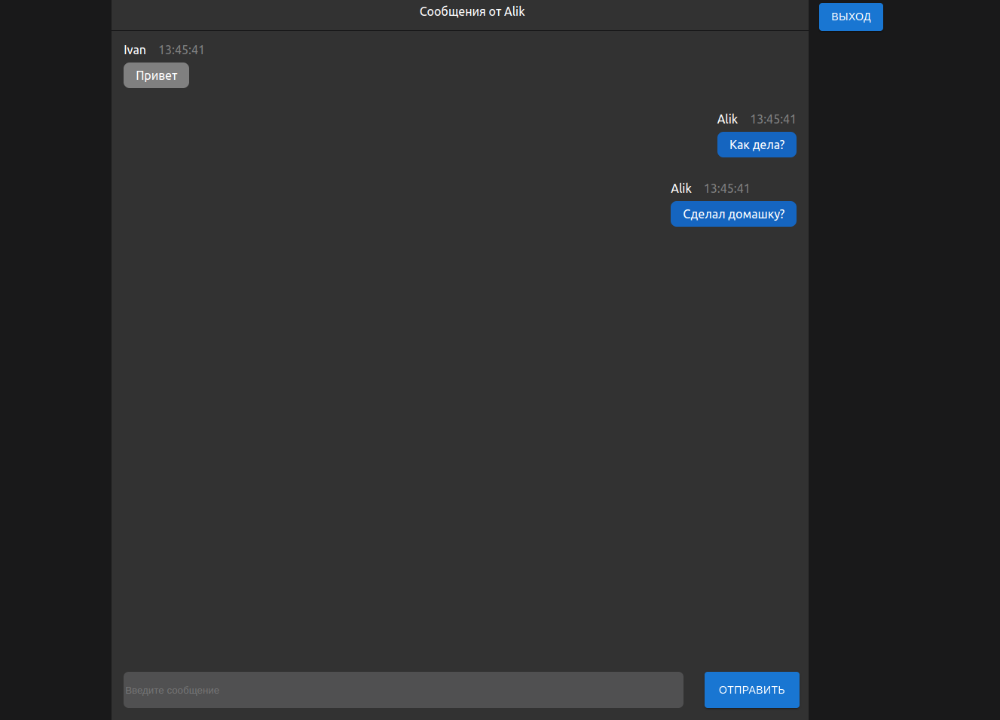

---

### HTTP метод для транспортного уровня

Добавим HTTP метод еа сервер, чтобы отправлять сообщение на транспортный уровень:

**index.ts**

```typescript
import express from 'express';
import axios from 'axios';
import http from 'http';
import ws, { type WebSocket } from 'ws';

const port: number = 8001; // порт на котором будет развернут этот (вебсокет) сервер
const hostname = 'localhost'; // адрес вебсокет сервера
const transportLevelPort = 8002; // порт сервера транспортного уровня
const transportLevelHostname = '192.168.12.172'; // адрес сервера транспортного уровня

interface Message {
  id?: number
  username: string
  data?: string
  send_time?: string
  error?: string
}

type Users = Record<string, Array<{
  id: number
  ws: WebSocket
}>>

const app = express() // создание экземпляра приложения express
const server = http.createServer(app) // создание HTTP-сервера

// Используйте express.json() для парсинга JSON тела запроса
app.use(express.json())

app.post('/receive', (req: { body: Message }, res: { sendStatus: (arg0: number) => void }) => {
  const message: Message = req.body
  sendMessageToOtherUsers(message.username, message)
  res.sendStatus(200)
})

// запуск сервера приложения
server.listen(port, hostname, () => {
  console.log(`Server started at http://${hostname}:${port}`)
})

const wss = new ws.WebSocketServer({ server })
const users: Users = {}

const sendMsgToTransportLevel = async (message: Message): Promise<void> => {
  const response = await axios.post(`http://${transportLevelHostname}:${transportLevelPort}/send`, message)
  if (response.status !== 200) {
    message.error = 'Error from transport level by sending message'
    users[message.username].forEach(element => {
      if (message.id === element.id) {
        element.ws.send(JSON.stringify(message))
      }
    })
  }
  console.log('Response from transport level: ', response)
}

function sendMessageToOtherUsers (username: string, message: Message): void {
  const msgString = JSON.stringify(message)
  for (const key in users) {
    console.log(`[array] key: ${key}, users[keys]: ${JSON.stringify(users[key])} username: ${username}`)
    if (key !== username) {
      users[key].forEach(element => {
        element.ws.send(msgString)
      })
    }
  }
}

wss.on('connection', (websocketConnection: WebSocket, req: Request) => {
  if (req.url.length === 0) {
    console.log(`Error: req.url = ${req.url}`)
    return
  }
  // eslint-disable-next-line @typescript-eslint/ban-ts-comment
  // @ts-expect-error
  const url = new URL(req?.url, `http://${req.headers.host}`)
  const username = url.searchParams.get('username')

  if (username !== null) {
    console.log(`[open] Connected, username: ${username}`)

    if (username in users) {
      users[username] = [...users[username], { id: users[username].length, ws: websocketConnection }]
    } else {
      users[username] = [{ id: 1, ws: websocketConnection }]
    }
  } else {
    console.log('[open] Connected')
  }

  console.log('users collection', users)

  websocketConnection.on('message', (messageString: string) => {
    console.log('[message] Received from ' + username + ': ' + messageString)

    const message: Message = JSON.parse(messageString)
    message.username = message.username ?? username

    void sendMsgToTransportLevel(message)
  })

  websocketConnection.on('close', (event: any) => {
    console.log(username, '[close] Соединение прервано', event)

    delete users.username
  })
})
```

### Postman

Давайте протестируем наше приложение в постмане. Создаем новый POST запрос с урлом http://localhost:8001/receive

Тело запроса выбираем raw, и вставляем туда json

```json
{
  "username": "Alik",
  "data": "Привет! Как там с домашкой?",
  "send_time": "2024-02-23T13:45:41Z",
  "error": ""
}
```

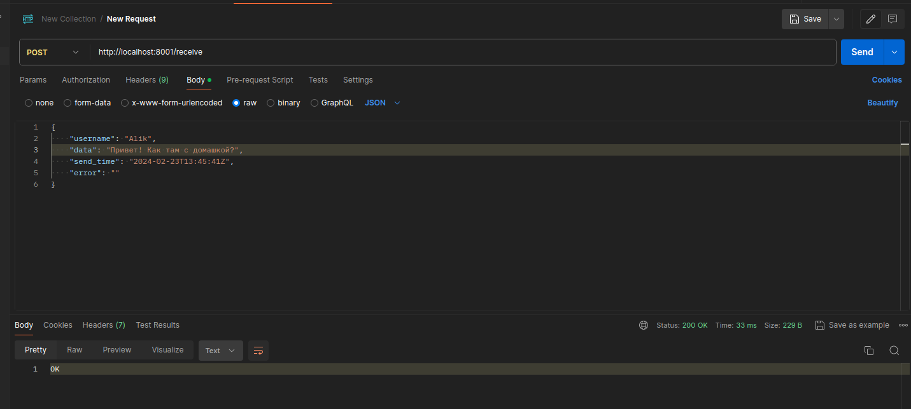

Отправляем, и получаем на странице результат:

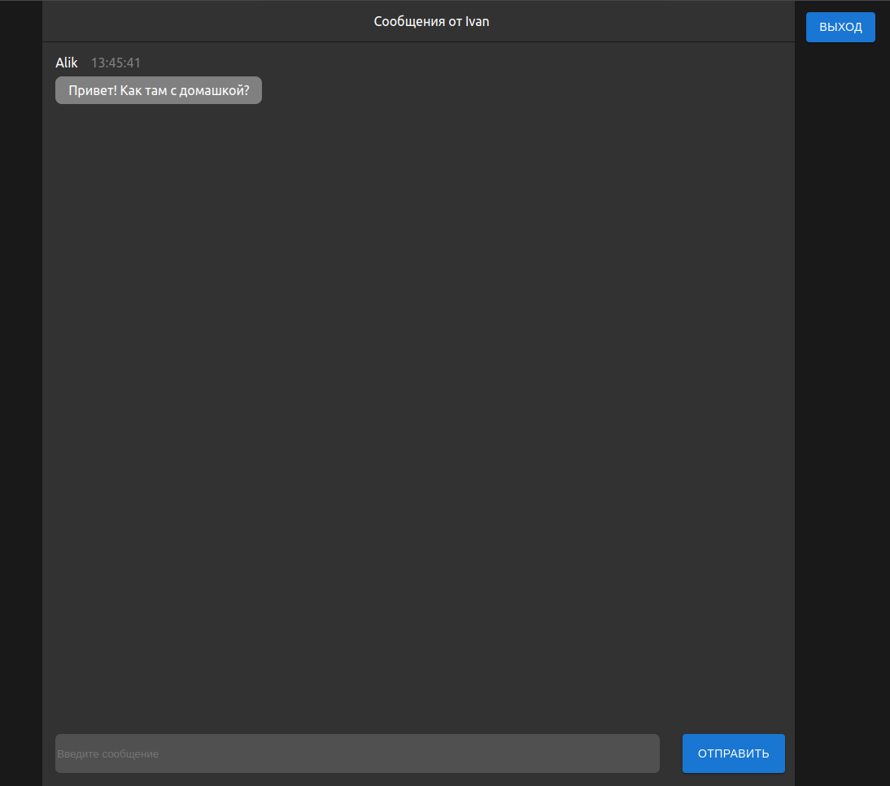

Получилось! Поздравляю, мы с вами освоили вебсокеты и сделали простой чат, к которому можно подключаться и отправлять 
сообщения всем пользователям в чате.  

---

> :bulb: Скорее всего в своем проекте вы будете исполльзовать git для контроля версий своего проекта. Небольшой совет по
использованию гита:
>
> Когда вы ставите зависимости в проекте с помощью npm, у вас появляются две очень тяжелые штуки - папка node_modules и
файл package-lock.json.
>
> В node_modules подтягиваются все зависимости из npm-реестра, необходимые для вашего проекта.
>
> В package-lock. json файле перечислены зависимости вашего приложения и зависимости всех его зависимостей. Другими
словами, он описывает, какую версию каждого отдельного пакета вы установили.
>
> Они очень тяжелые (даже в одном package-lock.json могут быть тысячи строк для небольшого проекта). Но эти файлы создаются
автоматически, когда вы подтягиваете зависимости через npm install. Поэтому нет смысла хранить их в гит-репозитории.
Их в любой момент можно сгенерировать (npm install), а вся необходимая информация для них будет храниться в package.json.
>
> Поэтому хорошей практикой считается помещать их в .gitignore файл.
