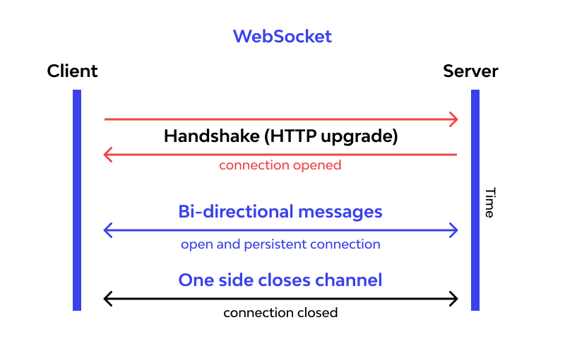

# WebSockets

# Задача

Интеграционна задача курсовой работы заключается в создании сервиса, который свяжет между собой бекенд и фронтенд. Конкретная задача может быть разной - отправление уведомлений, кеширование данных, брокер сообщений, s3 хранилище

В данном руководстве будет представлена упрощенная модель клиент-сервер. В курсовой логику взаимодействия сервиса с бекендом нужно будет написать самостоятельно.

# Теория

Протокол `WebSocket`(«веб-сокет») предоставляет возможность организации постоянного двустороннего обмена данными между браузером и сервером. Сервер в любой момент прислать сообщение клиенту, независимо, запрашивал ли его клиент или нет. Для этого браузеру нужно установить соединение с сервером посредством `handshake` («рукопожатия»)

Браузер, при помощи специальных заголовков, проверяет, поддерживает ли сервер обмен данными по Websocket, и если да, то они начинают общаться по протоколу WebSocket, который уже не является HTTP.



WebSocket используется для сервисов, которым необходим постоянный обмен данными:

- Игры
- Социальные сети и чат
- Торговые площадки
- Умный дом

Также может применяться в:

- Приложения с интенсивным обменом данными
- Кросс-доменные приложения

# Практика

Потребуется установить платформа Node.js. Инструкцию по скачиванию и установке Node.js можно найти на официальном [сайте](https://nodejs.org/)

Проект будет состоять из двух файлов:

- HTML-файл с разметкой, стилями и скриптом для отрисовки клиентской части
- JS-файл с серверной логикой, описывающей взаимодействие по сети

Определим струтуру проекта:

1. Создадим отдельный каталог под проект.
2. Инициализируем новый git-репозиторий в созданном каталоге.
3. Инициализируем новый npm-пакет, который будет содержать код проекта.
4. Установим необходимые для работы пакеты. Из сторонних зависимостей нам потребуется только библиотека [ws](https://www.npmjs.com/package/ws).
5. Создадим файл .gitignore, в который запишем каталог "node_modules", поскольку тянуть каталог с установленными зависимостями в git не стоит.

```bash
# Создадим каталог проекта и перейдем в него
mkdir websocket-example && cd websocket-example

# Инициализируем git-репозиторий
git init

# Инициализируем npm-пакет, который будет содержать код проекта
npm init -y

# Установим библиотеку для работы с WebSocket на сервере
npm install ws

# Укажем git не учитывать каталог с установленными зависимостями
touch .gitignore && echo "node_modules" >> .gitignore

```

Базовое окружение настроено, можно приступать к написанию приложения.

Организуем следующую структуру проекта:

node_modules    
public/index.html   
src/server.js   
.gitignore   
package‑lock.json   
package.json    

Определим задачи сервера:

- Сохранение текущего состояния истории сообщений.
- Отправка текущего состояния при подключении нового пользователя.
- При получении нового сообщения, разослать его всем подключенным клиентам.

Приступим к написанию серверной логики.

## **server.js**

1. Конфигурирование
    - Объявим необходимые зависимости
        
        ```jsx
        const ws = require("ws");
        const fs = require("fs");
        const http = require("http");
        ```
        
    - Подготовим документ, который будет возвращать http-сервер
        
        ```jsx
        const index = fs.readFileSync("public/index.html", "utf8");
        ```
        
    - Создадим http-сервер
        1. Задаем адрес хоста и порт, который будет прослушивать сервер. 
        2. Создадаем новый экземпляр сервера, в коллбеке указываем, что на все запросы сервер будет возвращать подготовленный index.html документ с 200 статус-кодом ответа.
        3. Запустим сервер, чтобы он начал прослушивать заданный хост и порт. Выведем в логи информацию об успешном начале работы сервера.
        
        ```jsx
        const HOST = "127.0.0.1";
        const PORT = 8000;
        
        const server = http.createServer((req, res) => {
            res.writeHead(200);
            res.end(index);
        });
        
        server.listen(PORT, HOST, () => {
            console.log(`Server running at http://${HOST}:${PORT}/`);
        });
        ```
        
    - Создадим Websocket-сервер, работающий поверх http-сервера
        
        ```jsx
        const wss = new ws.WebSocketServer({ server });
        ```
        
    - Объявим массив для хранения истории сообщений
        
        ```jsx
        const messages = [];
        ```
        
2. Логика сетевого взаимодействия
    - Новые подключения
        
        ```jsx
        /*
          Класс WebSocketServer имеет метод on, позволяющий погрузиться
          внутрь жизненного цикла клиентского соединения и производить какую-либо обработку событий.
        
          Метод принимает первым аргументом событие, а вторым коллбек на это событие
        
          Типы событий: "connection" | "message" | "error" | "close"
        
          Вторым аргументом передается коллбек-функция, параметрами которой будут
          текущее подключение и запрос, позволяющий получить служебную информацию
        */
        
        wss.on("connection", (websocketConnection, req) => {
            // здесь будет логика взаимодействия
        });
        ```
        
    - Обработка нового подключения
        
        При новом подключении в логи выводится ip-адрес клиента и происходит рассылка текущего состояния истории сообщений.
        
        ```jsx
        wss.on("connection", (websocketConnection, req) => {
            const ip = req.socket.remoteAddress;
            console.log(`[open] Connected ${ip}`);
        
        	broadcastMessages(messages, websocketConnection);
        });
        ```
        
    - Обработка получения сообщения
        
        При получении нового сообщения в логи выводится информация об этом, сообщение добавляется в список имеющихся сообщений и происходит рассылка всем остальным клиентам.
        
        ```jsx
        wss.on("connection", (websocketConnection, req) => {
            const ip = req.socket.remoteAddress;
            console.log(`[open] Connected ${ip}`);
        
        	broadcastMessages(messages, websocketConnection);
        
            websocketConnection.on("message", (message) => {
                console.log("[message] Received: " + message);
        
        		messages.push(message);
        
                broadcastMessage(message, websocketConnection);
            });
        });
        ```
        
    - Обработка отключения клиента
        
        При отключении в логи выводится ip-адрес отключившегося клиента.
        
        ```jsx
        wss.on("connection", (websocketConnection, req) => {
            const ip = req.socket.remoteAddress;
            console.log(`[open] Connected ${ip}`);
        
        	broadcastMessages(messages, websocketConnection);
        
            websocketConnection.on("message", (message) => {
                console.log("[message] Received: " + message);
        
        		messages.push(message);
        
                broadcastMessage(message, websocketConnection);
            });
        
            websocketConnection.on("close", () => {
                console.log(`[close] Disconnected ${ip}`);
            });
        });
        ```
        
    - Вспомогательные функции
        - Функция рассылки истории сообщений
            
            ```jsx
            function broadcastMessages(messages, client) {
                messages.forEach((message) =>
                    client.send(message, { binary: false })
                );
            }
            ```
            
        - Функция рассылки нового сообщения
            
            ```jsx
            /*
              Доступ к списку текущих подключений осуществляется
              через свойство clients сервера.
            
              Не забудем проверить, что клиент готов к получению и исключим клиента,
              сгенерировавшего это событие (у него оно уже есть).
            */
            
            function broadcastMessage(message, websocketConnection) {
                wss.clients.forEach((client) => {
                    if (client.readyState === ws.OPEN && client !== websocketConnection) {
                        client.send(message, { binary: false });
                    }
                });
            ```
            

На этом серверная логика заканчивается.

## index.html

В клиенткой части будет таблица, которую можно заполнять данными. При нажатии на любую ячейку, она подсвечивается и становится доступна для редактирования.


В public/index.html будет все: разметка, стили, динамика. Это необходимо сделать именно в index.html, так как сервер отдает только его.

- Определим струтуру html документа
    
    ```html
    <!DOCTYPE html>
    <html lang="en">
        <head>
            <style>
    	         <! -- здесь будут стили -->
            </style>
        </head>
        <body>
    				<! -- таблица, которая будет динамически обновляться -->
            <table id="table"></table>
        </body>
        <script>
    	    <! -- здесь будет логика -->
        </script>
    </html>
    ```
    
- Сконфигурируем таблицу
    
    ```jsx
    const COLUMNS = ["A", "B", "C", "D", "E", "F", "G", "I", "K", "L", "M", "O"];
    const ROW_COUNT = 30;
    
    const table = document.querySelector("#table");
    ```
    
- Создадим объект для хранения значений ячеек таблицы
    
    ```jsx
    const cells = {};
    ```
    
- Инициируем Websocket-соединение с сервером
    
    Для установки соединения клиентский скрипт создает объект WebSocket, в конструктор которого передает параметр WebSocket URI, и определяет функции обратного вызова при соединении, получении сообщения и разрыве соединения.
    
    ```jsx
    const HOST = "127.0.0.1";
    const PORT = "8000";
    
    const url = `ws://${HOST}:${PORT}/`;
    
    const socket = new WebSocket(url);
    ```
    
- Логика получения события
    
    ```jsx
    socket.onmessage = function (event) {
    	const data = JSON.parse(event.data);
    
        const cell = cells[data.cell];
        cell.value = data.value;
    };
    ```
    
- Логика отправки события
    
    На каждой ячейке висит слушатель события нажатия клавиши (keyup). При вводе данных в ячейку, слушатель отработает и сгенерирует событие, из которого можно будет "вытащить" адрес ячейки, в которой оно произошло и введенный текст.
    
    Далее отравляем эти данные в сокет
    
    ```jsx
    function onKeyup(event) {
    	const message = {
    		cell: event.target.id,
            value: event.target.value,
        };
    
    	socket.send(JSON.stringify(message));
    }
    ```
    
- Вспомогательные функции
    - Функция генерации таблицы
        
        ```jsx
        function generateTable(table, columns) {
        	const tr = document.createElement("tr");
        
            tr.innerHTML =
        		    "<td></td>" +
        	      columns.map((column) => `<td>${column}</td>`).join("");
        
            table.appendChild(tr);
        }
        ```
        
    - Функция генерации строки
        
        ```jsx
        function generateRow(table, rowIndex, columns) {
            const tr = document.createElement("tr");
        
            tr.innerHTML =
                `<td>${rowIndex}</td>` +
                columns
                    .map(
                        (column) =>
                            `<td><input id="${column}${rowIndex}" type="text"></td>`
                    )
                    .join("");
        
            table.appendChild(tr);
        
            columns.forEach((column) => {
                const cellId = `${column}${rowIndex}`;
        
                const input = document.getElementById(cellId);
        
                input.addEventListener("keyup", onKeyup);
        
                cells[cellId] = input;
            });
        }
        ```
        
    - Функция заполнения таблицы
        
        ```jsx
        function fillTable(table) {
        	for (let i = 1; i <= ROW_COUNT; i++) {
        		KgenerateRow(table, i, COLUMNS);
            }
        }
        ```
        
    
- Отрисовка таблицы
    
    Для отрисовки таблицы вызовем подготовленные вспомогательные функции генерации и заполнения таблицы
    
    ```jsx
    generateTable(table, COLUMNS);
    
    fillTable(table);
    ```
    
- Стили
    
    ```css
    						*,
                html {
                    margin: 0;
                    padding: 0;
                    border: 0;
    
                    width: 100%;
                    height: 100%;
                }
    
                body {
                    width: 100%;
                    height: 100%;
    
                    position: relative;
                }
    
                input {
                    margin: 2px 0;
                    padding: 4px 9px;
    
                    box-sizing: border-box;
    
                    border: 1px solid #ccc;
    
                    outline: none;
                }
    
                input:focus {
                    border: 1px solid #0096ff;
                }
    
                table,
                table td {
                    border: 1px solid #cccccc;
                }
    
                td {
                    height: 20px;
                    width: 80px;
    
                    text-align: center;
                    vertical-align: middle;
                }
    ```
    

Если вы сделали все правильно, то при запуске сервера вы увидите сообщение об успешном старте

```bash
websocket-example git:(main) ✗ node src/server.js
Server running at http://127.0.0.1:8000/
```

Теперь, если зайти на [http://127.0.0.1:8000/](http://127.0.0.1:8000/) откроется редактируемая таблица. 

Запустив несколько экземпляров браузера можно посмотреть, как все работает. Проверьте, что при новом подключении откроется заполненная данными таблица, если в нее уже вносились какие-либо изменения.


Посмотрев консоль запущенного сервера, можно увидеть логи о происходящих событиях.

На этом все.

- Что почитать, если заинтересовала тема
    
    [WebSocket](https://learn.javascript.ru/websocket)
     
    [RFC 6455: The WebSocket Protocol](https://www.rfc-editor.org/rfc/rfc6455)
     
    [WebSockets - полноценный асинхронный веб](https://habr.com/ru/post/79038/)